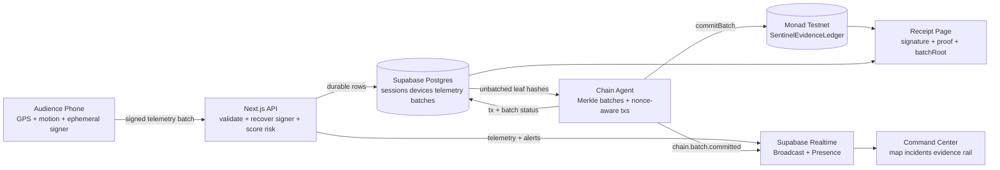
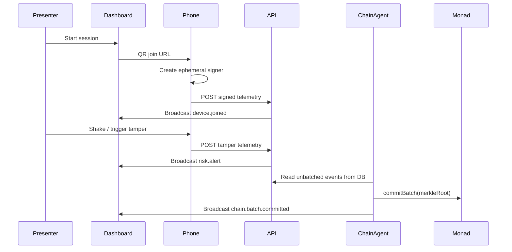

# Monad Sentinel

**Stop trusting GPS. Prove custody.**

Monad Sentinel is a live proof-of-custody swarm for high-value logistics. A presenter starts a session and shows one QR code. Audience phones join as temporary signed sensor witnesses, stream browser telemetry, trigger tamper alerts when shaken, and have their telemetry hashes batched into Merkle roots committed to Monad.

The demo is designed to be useful even when GPS is bad, Wi-Fi is noisy, or Monad RPC is slow: realtime UX stays off-chain, evidence commitments are compact, and simulation mode remains available.

## What It Demonstrates

- QR-powered phone onboarding with no wallet popup and no testnet tokens for the audience.
- Ephemeral local device keys that sign EIP-712 telemetry.
- Realtime command center with map, evidence rail, incident feed, sound, and 50-device simulation.
- Deterministic risk agents for shake/tamper, geofence exit, GPS jump, battery, and accuracy loss.
- Supabase/Postgres as the app state and realtime layer.
- Monad Testnet smart contract as the tamper-evident evidence rail.

## Architecture



Monad is used for compact evidence commitments, not raw GPS storage. Supabase handles high-frequency room state and temporary raw telemetry.

## Quick Start

```bash
pnpm install
pnpm dev
```

Open `http://localhost:3000`, click **Start Live Custody Swarm**, then use the dashboard demo controls:

- **Spawn 50** to fill the command center.
- **Trigger theft** to create a tamper incident.
- **Commit batch** to create a simulated evidence block.
- Open `/s/[sessionId]` on a phone to test the mobile witness flow.

The app runs in local demo mode without Supabase or Monad credentials.

## Public QR Behavior

Set `NEXT_PUBLIC_APP_URL` in production:

```txt
NEXT_PUBLIC_APP_URL=https://your-vercel-domain.app
```

The dashboard QR uses that value first. This prevents the projector QR from pointing to `localhost` after deployment.

## Project Layout

```txt
apps/web                 Next.js App Router frontend and API routes
packages/shared          Telemetry schema, EIP-712, hashing, risk, Merkle helpers
packages/contracts       Solidity SentinelEvidenceLedger contract
packages/chain-agent     Long-running Merkle batch and Monad commit worker
supabase/migrations      Postgres schema for sessions, devices, telemetry, proofs
docs                     Architecture, protocol, decisions, runbook
```

## Scripts

```bash
pnpm dev               # Next.js app
pnpm build             # production build
pnpm test              # shared + chain-agent TypeScript checks
pnpm agent:dev         # batch worker
pnpm contracts:build   # Foundry build, requires forge
pnpm contracts:test    # Foundry tests, requires forge
pnpm contracts:deploy  # deploy SentinelEvidenceLedger to Monad
```

## Environment

Copy `.env.example` to `.env.local` for local development.

Minimum local demo:

```txt
NEXT_PUBLIC_APP_URL=http://localhost:3000
NEXT_PUBLIC_CHAIN_DISABLED=true
CHAIN_DISABLED=true
```

Real Supabase + Monad mode:

```txt
NEXT_PUBLIC_APP_URL=https://your-vercel-domain.app
NEXT_PUBLIC_SUPABASE_URL=
NEXT_PUBLIC_SUPABASE_PUBLISHABLE_KEY=
SUPABASE_SECRET_KEY=
NEXT_PUBLIC_MONAD_CHAIN_ID=10143
NEXT_PUBLIC_MONAD_EXPLORER_URL=
NEXT_PUBLIC_CONTRACT_ADDRESS=
MONAD_RPC_URL=
GATEWAY_PRIVATE_KEY=
CHAIN_DISABLED=false
```

Never expose `SUPABASE_SECRET_KEY`, `SUPABASE_SERVICE_ROLE_KEY`, or `GATEWAY_PRIVATE_KEY` to browser code.

## Demo Flow



## Documentation

- [Architecture](docs/architecture.md)
- [Telemetry Protocol](docs/protocol.md)
- [System Decisions](docs/decisions.md)
- [Demo and Deployment Runbook](docs/runbook.md)
- [Codebase Map](docs/codebase-map.md)

## Current Limits

- Contract tests require Foundry. `forge` was not available in the current local environment.
- Supabase realtime is optional in local mode; without env vars, the app falls back to in-memory dashboard simulation.
- Browser battery data is optional by design. GPS and motion also degrade gracefully when unavailable.
