# Monad Sentinel

**Make logistics telemetry provable without making it public.**

Monad Sentinel is the privacy-preserving evidence layer for logistics IoT and shipment-visibility platforms. It is not another GPS tracker. Existing platforms already collect GPS, temperature, shock, seal, battery, handoff, and EPCIS-style events; Sentinel turns those events into encrypted, signed, hash-chained, Merkle-batched evidence receipts anchored to Monad.

The core rule is simple:

```txt
Private telemetry every second.
Public proof roots every batch.
No raw route, customer, product, or device identity on-chain.
```

## Demo Privacy Promise

For live audience demos, participant phone telemetry is treated as temporary demo data:

- raw/encrypted phone telemetry is collected only for the live session
- demo sessions expire after **30 minutes** and the API opportunistically deletes expired rows
- participants can use indoor spatialization instead of real GPS
- simulated witnesses can fully run the pitch if nobody shares location
- simulated mode never pretends to be real Monad proof

The permanent artifact is the proof concept: signed events, salted commitments, Merkle roots, and receipts. The demo should not retain audience location history after the presentation window.

## What Sentinel Proves

- A sensor event existed at a given time.
- A device key signed the event.
- The event was linked to the prior event in the journey.
- The raw payload was encrypted and committed with salted hashes.
- The event was included in a Merkle batch.
- The batch root was anchored to Monad when real chain mode is enabled.
- A receipt can selectively reveal and verify one event without exposing the full shipment history.

## Product Positioning

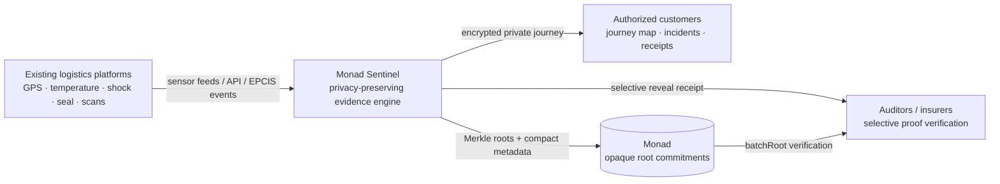

Existing visibility platforms help customers monitor. Sentinel helps them prove.

## Screenshots

These screenshots are kept in [`docs/screenshots`](docs/screenshots) so judges can understand the product without running the realtime demo.

| Screen | Purpose |
| --- | --- |
| 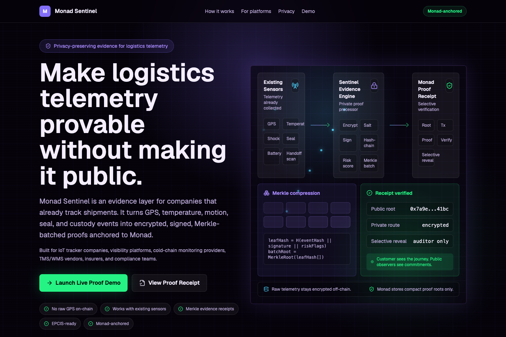 | New positioning: evidence layer, not another tracker. |
| 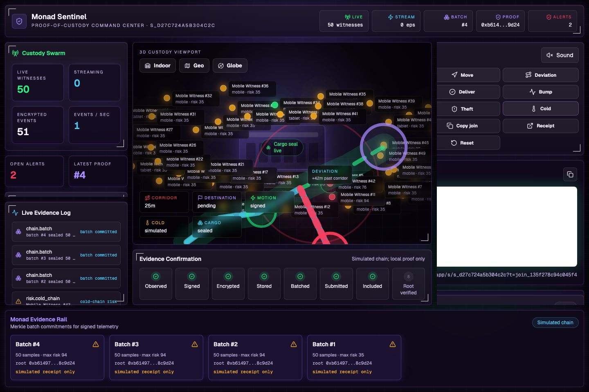 | Live command center with QR, swarm, evidence rail, and presenter controls. |
| 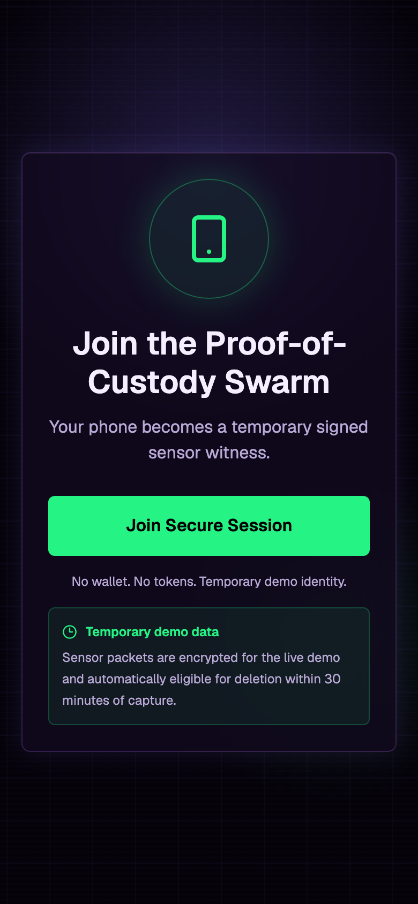 | Phone-as-sensor onboarding. |
| 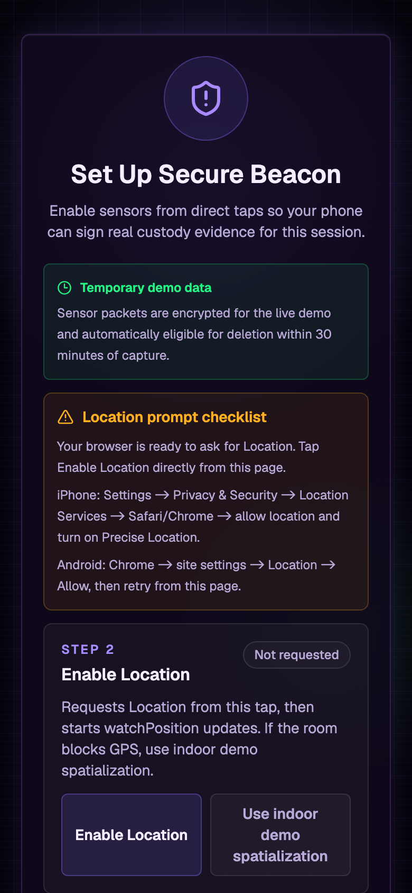 | Explicit location and motion permission ceremony. |
| 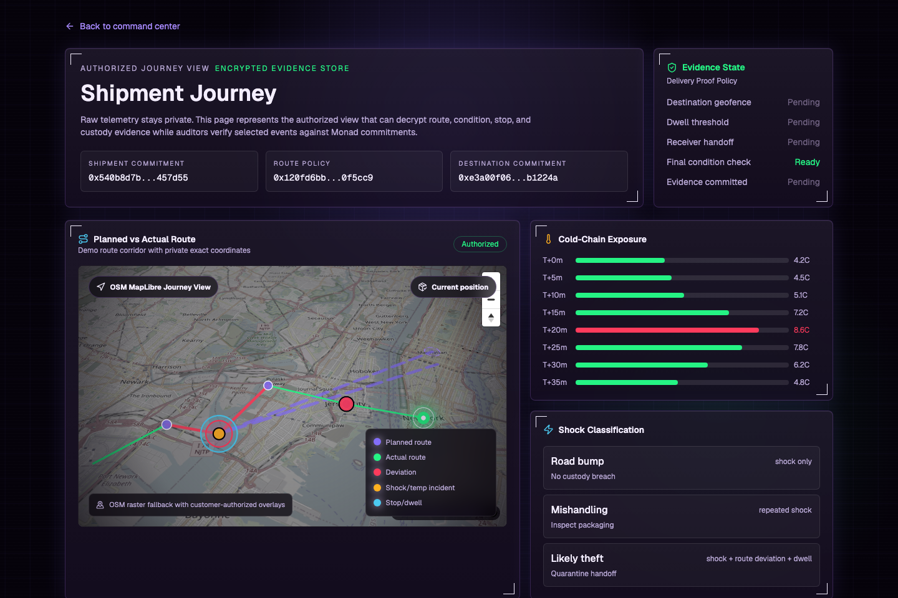 | Authorized MapLibre journey view with route, stops, incidents, and delivery policy. |
| 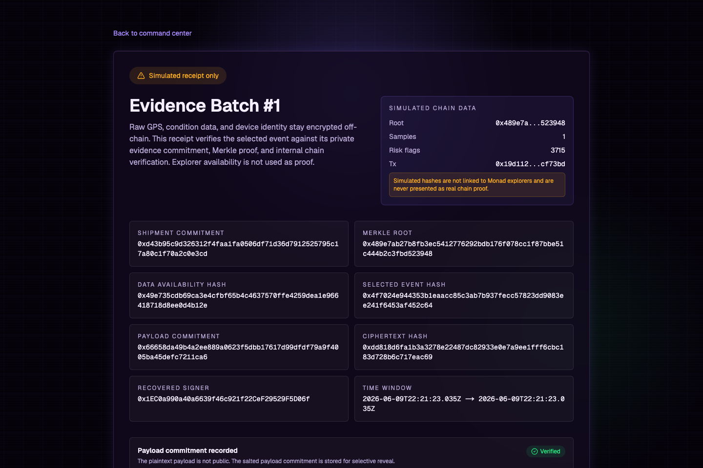 | Simulated-chain receipt guardrails: no fake explorer link, no fake Monad verification. |
| 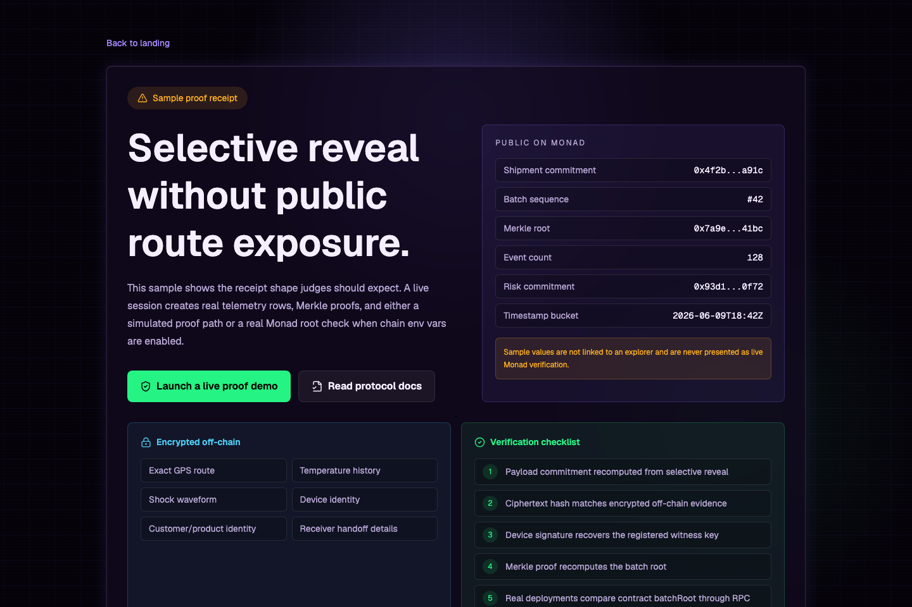 | Receipt explanation for signature, Merkle proof, and root verification. |
| 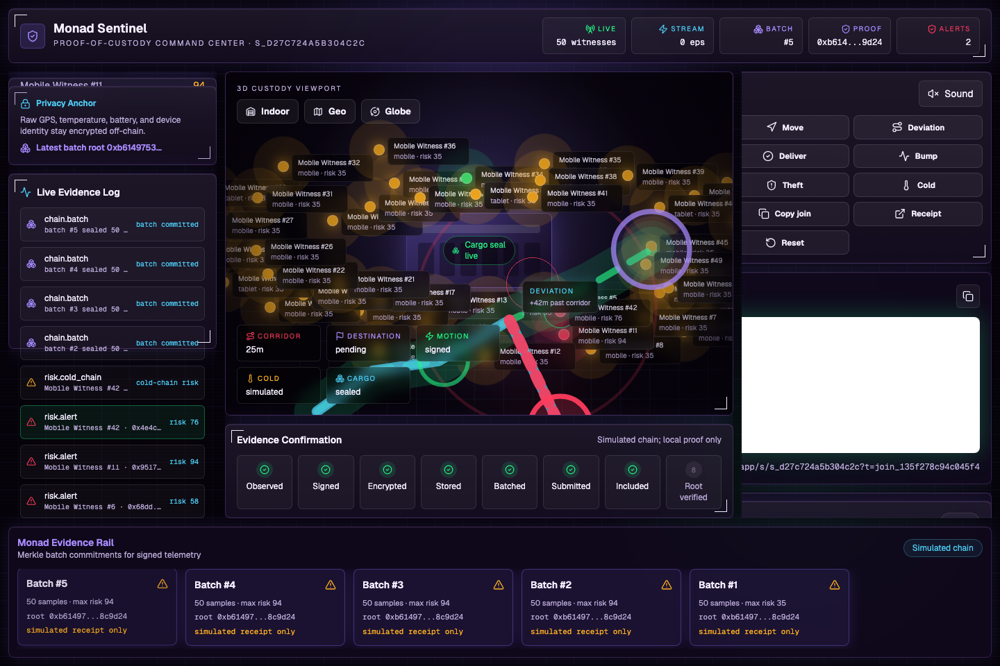 | Per-witness source-to-destination history, privacy state, incidents, and latest batch proof. |
| 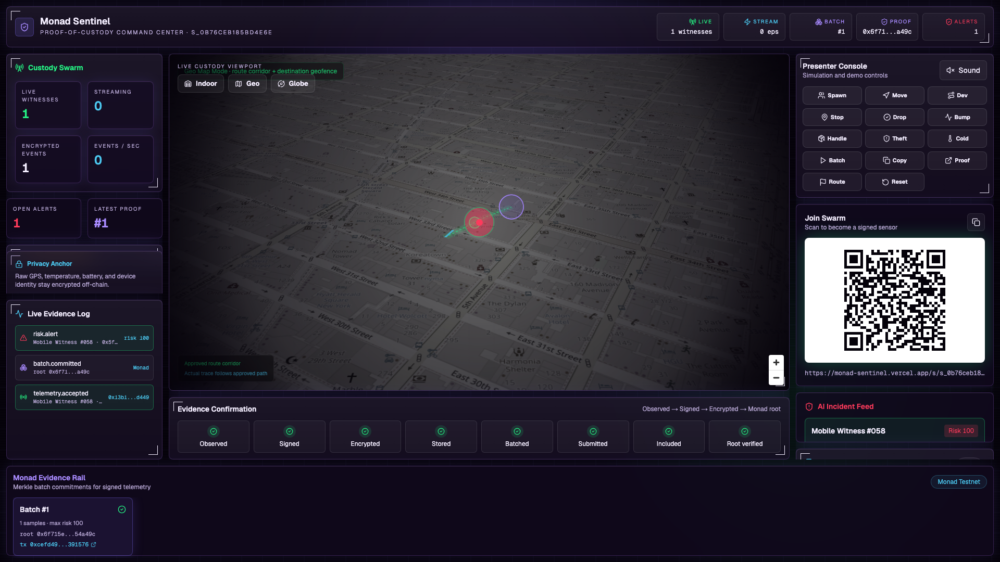 | Production dashboard showing a real Monad Testnet batch, tx hash, and verified evidence rail. |
| 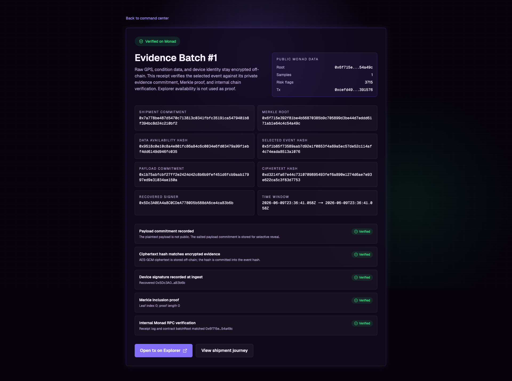 | Verified receipt where payload commitment, ciphertext hash, signature record, Merkle proof, and contract root all pass. |
| 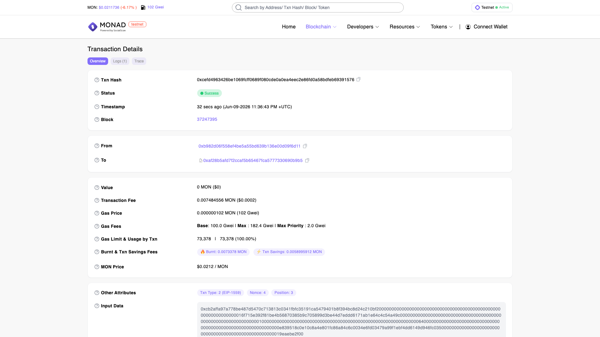 | Actual Monad Testnet transaction page showing the successful `commitBatch` transaction to the deployed ledger. |

The real-chain screenshots above were captured after `/api/chain/verify-batch` returned `verified=true` against Monad RPC. The demo session rows are temporary by design, but the on-chain transaction remains independently verifiable.

```txt
Production app:       https://monad-sentinel.vercel.app
Monad Testnet ledger: 0xAF28B5Afd7f2CCaF5b65467fca5777330690b9b5
Verified batch tx:    0xcefd4963426be1069fcff0689f080cde0a0ea4eec2e86fd0a58bdfeb69391576
Verified block:       37247395
Batch root:           0x6f715e392f81be4b56870385b9c705899d3be44d7eddd6171ab1e64c4c54a49c
```

## System Overview

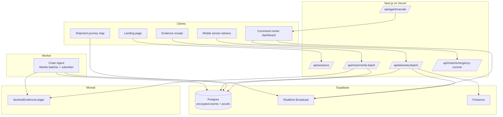

Supabase is the encrypted data availability and realtime layer. Monad is the public integrity anchor. The database can make data queryable, but it is not the trust root.

## Private Evidence Protocol

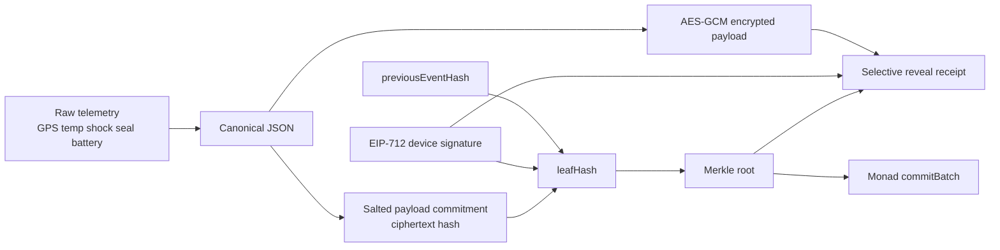

Monad stores only opaque commitments:

- `shipmentCommitment`
- `batchSequence`
- `merkleRoot`
- `sampleCount`
- `maxRiskScore`
- `combinedFlags`
- `dataAvailabilityHash`
- `timeBucket`

Monad does not store raw GPS, route geometry, customer identity, product identity, temperature history, shock waveforms, or device identity.

## Current User Flows

### Live Demo

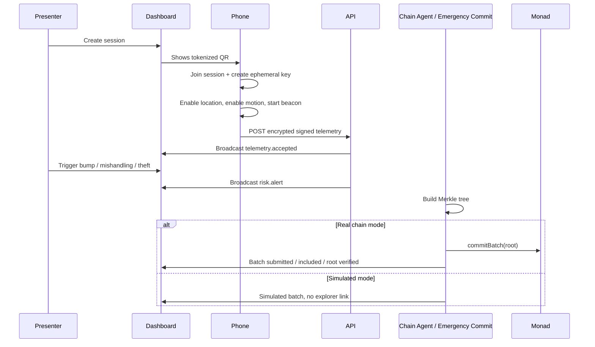

### Mobile Permission Ceremony

The mobile page does not silently fall back. It asks for browser capabilities from direct user gestures:

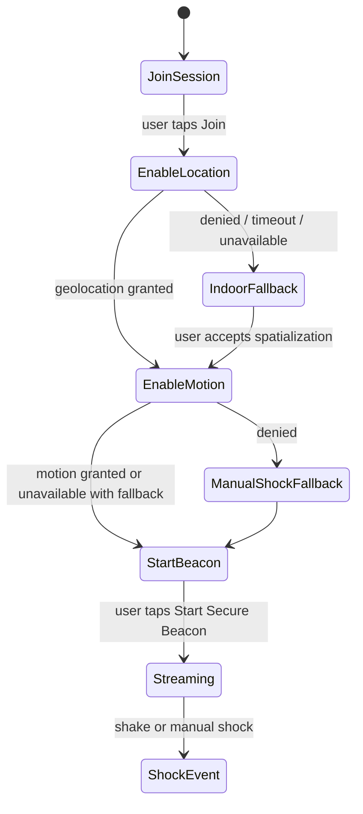

## Chain Verification Truth

The explorer is not the source of truth. `/api/chain/verify-batch` verifies batches internally:

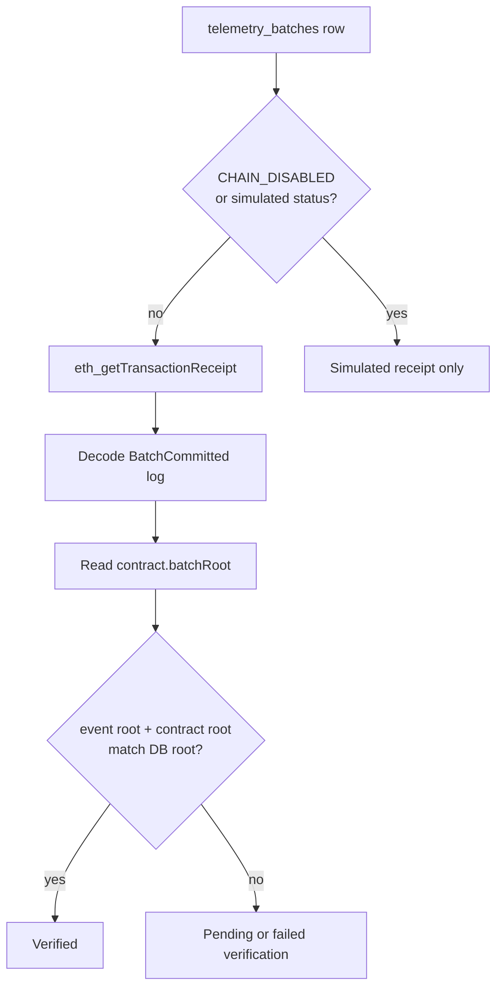

When `CHAIN_DISABLED=true` or `NEXT_PUBLIC_CHAIN_MODE=simulated`, the UI disables Monad explorer links and never displays simulated hashes as real Monad proof.

## Quick Start

```bash
pnpm install
pnpm dev
```

Open `http://localhost:3000`, launch a demo session, and use the dashboard controls:

- **Spawn 50** creates a live witness swarm.
- **Bump** shows shock without custody breach.
- **Mishandling** shows repeated handling risk.
- **Theft** combines shock with simulated route deviation / unauthorized dwell / seal risk.
- **Cold breach** simulates temperature exposure.
- **Movement / deviation controls** let the presenter show threshold behavior even if indoor GPS is poor.
- **Emergency batch** creates a Merkle batch; in simulated mode it is clearly labeled.
- `/shipment/[sessionId]` opens the authorized journey map.
- `/receipt/[sessionId]/[batchId]` opens the evidence receipt.

If real phones deny location or the room has poor GPS, use the explicit **indoor demo spatialization** fallback on the phone and the dashboard simulation controls. The product claim remains accurate: the phone is a sensor emulator, while the proof protocol is the core demo.

## Scripts

```bash
pnpm dev                         # Next.js app
pnpm build                       # production build
pnpm test                        # TypeScript/unit checks
pnpm agent:dev                   # chain-agent worker
pnpm contracts:build             # Foundry build, requires forge
pnpm contracts:test              # Foundry tests, requires forge
pnpm contracts:deploy            # deploy SentinelEvidenceLedger
pnpm sentinel:init               # one-time setup checklist
pnpm sentinel:verify             # test + build + optional contracts
pnpm sentinel:doctor             # cloud/local health checks
pnpm sentinel:launch             # local launch helper
pnpm sentinel:launch --prod      # Vercel deployment + live session QR
pnpm sentinel:launch --prod --real-chain
```

## Environment

Minimum local demo:

```txt
NEXT_PUBLIC_APP_URL=http://localhost:3000
NEXT_PUBLIC_CHAIN_MODE=simulated
NEXT_PUBLIC_CHAIN_DISABLED=true
CHAIN_DISABLED=true
```

Real Supabase + Monad mode:

```txt
NEXT_PUBLIC_APP_URL=https://your-vercel-domain.app
NEXT_PUBLIC_SUPABASE_URL=
NEXT_PUBLIC_SUPABASE_PUBLISHABLE_KEY=
SUPABASE_SECRET_KEY=
NEXT_PUBLIC_MONAD_CHAIN_ID=10143
NEXT_PUBLIC_CONTRACT_ADDRESS=
MONAD_RPC_URL=
GATEWAY_PRIVATE_KEY=
CHAIN_DISABLED=false
NEXT_PUBLIC_CHAIN_DISABLED=false
NEXT_PUBLIC_CHAIN_MODE=real
```

Never expose `SUPABASE_SECRET_KEY`, `SUPABASE_SERVICE_ROLE_KEY`, `GATEWAY_PRIVATE_KEY`, or model-provider API keys to browser code or commits.

## Project Layout

```txt
apps/web                 Next.js frontend, API routes, mobile flow, dashboard, receipts
packages/shared          protocol schemas, hashing, signatures, Merkle, risk algorithms
packages/contracts       Solidity evidence ledger
packages/chain-agent     worker for Merkle batching and Monad submissions
supabase/migrations      app data, encrypted evidence, journey, delivery schema
docs                     architecture, protocol, algorithms, runbook, judge Q&A
```

## Documentation

- [Architecture](docs/architecture.md)
- [Private Evidence Protocol](docs/protocol.md)
- [Algorithms](docs/algorithms.md)
- [System Decisions](docs/decisions.md)
- [Demo and Deployment Runbook](docs/runbook.md)
- [Codebase Map](docs/codebase-map.md)
- [Agentic System](docs/agentic-system.md)
- [Judge Q&A](docs/judge-qa.md)

## Current Limits

- Real Monad verification requires `CHAIN_DISABLED=false`, Monad RPC, a funded gateway key, and deployed `SentinelEvidenceLedger`.
- Local/cloud simulated mode verifies protocol mechanics but is labeled as simulation and has no explorer links.
- The current AI narration route is deterministic fallback. Optional LLM agents must use typed tools, structured outputs, and no direct DB/chain mutation.
- Browser battery, GPS, and motion APIs vary by device and permission state; the app degrades to indoor spatialization and manual shock fallback.
- Contract tests require Foundry (`forge`).
