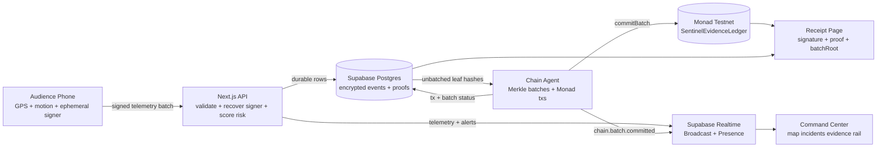
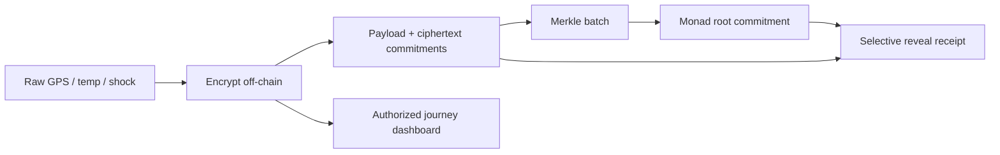
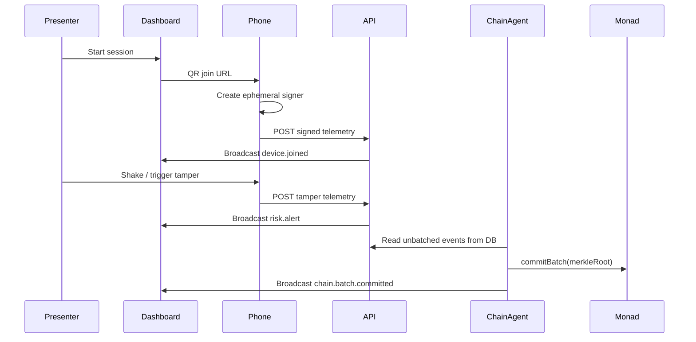

# Monad Sentinel

**Stop trusting GPS. Prove custody.**

Monad Sentinel is a privacy-preserving proof-of-custody layer for pharma, medical, food, FMCG, luxury, and high-value logistics. A presenter starts a session and shows one QR code. Audience phones join as temporary signed sensor witnesses, stream browser telemetry, trigger shock/tamper scenarios, and have encrypted evidence leaves batched into Merkle roots committed to Monad.

The product does **not** publish raw GPS on-chain. Raw telemetry is encrypted off-chain. Devices sign events. Events are hash-linked. Monad stores compact Merkle roots and metadata so journey history cannot be silently rewritten.

## What It Demonstrates

- QR-powered phone onboarding with no wallet popup and no testnet tokens for the audience.
- Ephemeral local device keys that sign EIP-712 telemetry.
- Realtime command center with indoor command room, geo map, globe mode, evidence rail, incident feed, sound, and 50-device simulation.
- Private Evidence Protocol: salted payload commitments, AES-GCM encrypted evidence, ciphertext hashes, hash-linked events, and Merkle batch roots.
- Deterministic risk agents for bump, mishandling, likely theft, route deviation, cold-chain excursion, and delivery evidence.
- Supabase/Postgres as the app state and realtime layer.
- Monad Testnet smart contract as the public evidence anchor.
- Judge-facing receipts and journey views that explain what is public, private, and verified.

## Architecture



Monad is used for compact evidence commitments, not raw GPS storage. Supabase handles high-frequency room state, encrypted telemetry envelopes, Merkle proofs, and journey visualization.

## Privacy Model



Public on Monad:

- shipment commitment
- Merkle root
- batch sequence
- sample count
- combined risk flags
- data availability hash
- timestamp bucket
- tx hash

Private off-chain:

- exact route and GPS
- temperature and shock timeline
- device identity
- product/customer identity
- handoff details

## Quick Start

```bash
pnpm install
pnpm dev
```

Open `http://localhost:3000`, click **Start Live Custody Swarm**, then use the dashboard demo controls:

- **Spawn 50** to fill the command center.
- **Bump**, **Mishandling**, and **Theft** to show the risk model does not equate every shake with theft.
- **Cold breach** to simulate cargo temperature risk.
- **Emergency batch** to create a simulated evidence block.
- Open `/s/[sessionId]` on a phone to test the mobile witness flow.
- Open `/shipment/[sessionId]` to see the authorized journey map and delivery proof policy.

The app runs in local demo mode without Supabase or Monad credentials.

## Public QR Behavior

Set `NEXT_PUBLIC_APP_URL` in production:

```txt
NEXT_PUBLIC_APP_URL=https://your-vercel-domain.app
```

The dashboard QR uses that value first. This prevents the projector QR from pointing to `localhost` after deployment.

## Project Layout

```txt
apps/web                 Next.js App Router frontend and API routes
packages/shared          Telemetry schema, EIP-712, hashing, risk, Merkle helpers
packages/contracts       Solidity SentinelEvidenceLedger contract
packages/chain-agent     Long-running Merkle batch and Monad commit worker
supabase/migrations      Postgres schema for sessions, devices, telemetry, proofs
docs                     Architecture, protocol, algorithms, decisions, runbook
```

## Scripts

```bash
pnpm dev               # Next.js app
pnpm build             # production build
pnpm test              # shared + chain-agent TypeScript checks
pnpm agent:dev         # batch worker
pnpm contracts:build   # Foundry build, requires forge
pnpm contracts:test    # Foundry tests, requires forge
pnpm contracts:deploy  # deploy SentinelEvidenceLedger to Monad
pnpm sentinel:init     # print one-time setup checklist
pnpm sentinel:verify   # run app checks and build
pnpm sentinel:launch   # local launch helper
pnpm sentinel:launch --prod # Vercel launch helper with QR output
```

## Environment

Copy `.env.example` to `.env.local` for local development.

Minimum local demo:

```txt
NEXT_PUBLIC_APP_URL=http://localhost:3000
NEXT_PUBLIC_CHAIN_DISABLED=true
CHAIN_DISABLED=true
```

Real Supabase + Monad mode:

```txt
NEXT_PUBLIC_APP_URL=https://your-vercel-domain.app
NEXT_PUBLIC_SUPABASE_URL=
NEXT_PUBLIC_SUPABASE_PUBLISHABLE_KEY=
SUPABASE_SECRET_KEY=
NEXT_PUBLIC_MONAD_CHAIN_ID=10143
NEXT_PUBLIC_MONAD_EXPLORER_URL=
NEXT_PUBLIC_CONTRACT_ADDRESS=
MONAD_RPC_URL=
MONAD_WS_URL=
GATEWAY_PRIVATE_KEY=
CHAIN_DISABLED=false
```

Never expose `SUPABASE_SECRET_KEY`, `SUPABASE_SERVICE_ROLE_KEY`, or `GATEWAY_PRIVATE_KEY` to browser code.

## Demo Flow



## Documentation

- [Architecture](docs/architecture.md)
- [Private Evidence Protocol](docs/protocol.md)
- [Algorithms](docs/algorithms.md)
- [System Decisions](docs/decisions.md)
- [Judge Q&A](docs/judge-qa.md)
- [Demo and Deployment Runbook](docs/runbook.md)
- [Codebase Map](docs/codebase-map.md)

## Current Limits

- Contract tests require Foundry. `forge` was not available in the current local environment.
- Supabase realtime is optional in local mode; without env vars, the app falls back to in-memory dashboard simulation.
- Browser battery data is optional by design. GPS and motion also degrade gracefully when unavailable.
- `pnpm sentinel:launch --prod` checks Vercel login and required env, but still expects first-time Vercel/Supabase/Foundry setup to be completed by the operator.
