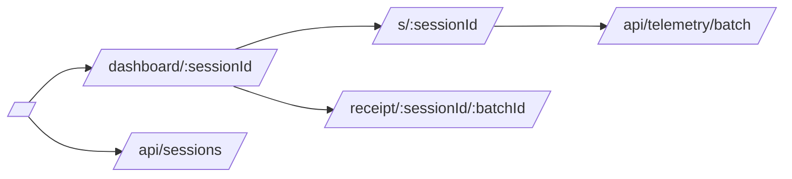

# Web App

Next.js App Router application for Monad Sentinel.

## Responsibilities

- Landing page and public session start.
- Dashboard command center.
- Mobile sensor witness page.
- Evidence receipt page.
- API routes for sessions, telemetry ingest, simulation, and deterministic narration.

## Route Map



## Key Files

- `app/page.tsx`: product landing and session CTA.
- `app/dashboard/[sessionId]/DashboardClient.tsx`: realtime command center shell.
- `app/s/[sessionId]/SensorContent.tsx`: mobile EIP-712 telemetry client.
- `components/command`: dashboard UI components.
- `components/three`: React Three Fiber visuals.
- `lib/store/sentinelStore.ts`: local live state and demo simulation.
- `lib/supabase`: Supabase clients.

## Local Development

```bash
pnpm --filter @monad-sentinel/web dev
```

The app works without Supabase by using local dashboard state and demo controls.
