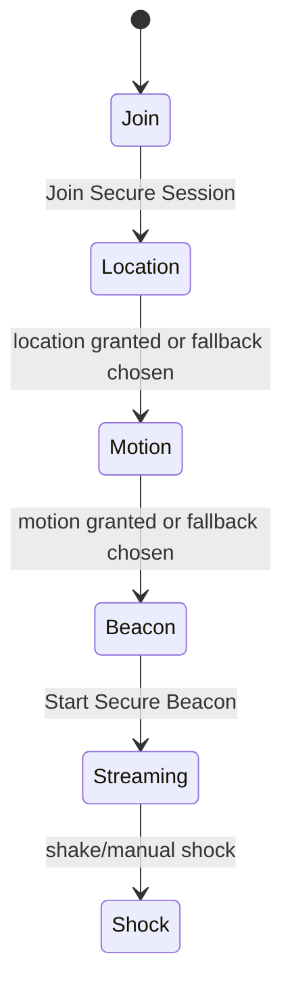

# Web App

Next.js App Router application for Monad Sentinel.

The web app handles the human-facing demo, API ingress, internal chain verification, mobile witness flow, journey map, and receipts. It is not the trust anchor; it coordinates Supabase availability data and Monad commitment verification.

## Responsibilities

- Landing page for the evidence-layer positioning.
- Session creation and tokenized QR onboarding.
- Dashboard command center.
- Mobile sensor witness permission ceremony.
- Signed telemetry ingest API.
- Serverless emergency Merkle batch endpoint for demo safety.
- Receipt verification through RPC + contract root.
- MapLibre journey and delivery policy view.
- Deterministic incident narration fallback.

## Route Map

```mermaid
flowchart TB
  Home[/ /<br/>landing]
  Create[/api/sessions/]
  Dashboard[/dashboard/:sessionId/]
  SessionAPI[/api/session/:sessionId/]
  Mobile[/s/:sessionId/]
  Telemetry[/api/telemetry/batch/]
  Shipment[/shipment/:shipmentId/]
  Receipt[/receipt/:sessionId/:batchId/]
  Verify[/api/chain/verify-batch/]
  Emergency[/api/chain/emergency-commit/]
  Narrate[/api/agent/narrate/]

  Home --> Create --> Dashboard
  Dashboard --> SessionAPI
  Dashboard --> Mobile
  Mobile --> Telemetry
  Dashboard --> Emergency
  Dashboard --> Shipment
  Dashboard --> Receipt
  Receipt --> Verify
  Dashboard --> Narrate
```

## Key Files

- `app/page.tsx`: landing and session CTA.
- `app/dashboard/[sessionId]/DashboardClient.tsx`: command center shell.
- `app/s/[sessionId]/SensorContent.tsx`: mobile witness flow.
- `app/shipment/[shipmentId]/page.tsx`: authorized journey and delivery view.
- `app/receipt/[sessionId]/[batchId]/page.tsx`: receipt UI.
- `app/api/telemetry/batch/route.ts`: signed telemetry ingest.
- `app/api/chain/verify-batch/route.ts`: internal chain verification.
- `components/command/*`: dashboard panels.
- `components/journey/JourneyMap.tsx`: MapLibre/OSM journey view.
- `lib/evidence/privateEvidence.ts`: encrypted private evidence envelope.
- `lib/chain/verification.ts`: viem receipt/log/root verification.
- `lib/sensors/browserSensors.ts`: GPS and motion permission helpers.
- `lib/sound/SoundEngine.ts`: Web Audio effects.
- `lib/store/sentinelStore.ts`: live dashboard store and local simulation.

## Mobile Sensor Flow



The app does not mark GPS or motion as fallback until the browser request fails or the user chooses demo spatialization.

## Chain Verification

```mermaid
flowchart LR
  Receipt[Receipt page]
  API[/api/chain/verify-batch/]
  DB[(telemetry_batches)]
  RPC[Monad RPC]
  Contract[batchRoot()]
  Result[verified / simulated / failed]

  Receipt --> API
  API --> DB
  API --> RPC
  RPC --> Contract
  Contract --> Result
```

Simulated batches never render explorer links.

## Local Development

```bash
pnpm --filter @monad-sentinel/web dev
```

The app can run without Supabase and Monad for local visual work. Real receipts require Supabase rows and real chain env.
