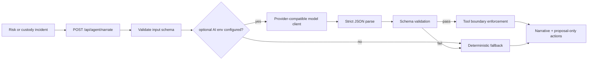
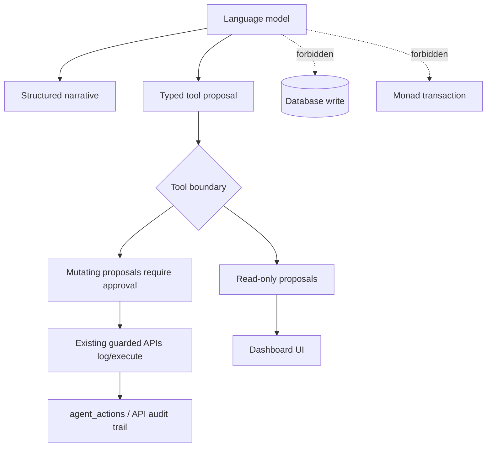
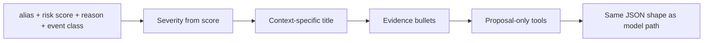

# Agentic System

Monad Sentinel uses agents only where they improve interpretation or workflow. The cryptographic evidence path does not depend on an LLM.

Current implementation truth:

- `/api/agent/narrate` has a deterministic fallback route.
- Risk classification, batching, and verification are deterministic.
- Provider-backed LLM narration is an extension path and must follow the guardrails below.
- No model API key should be committed or exposed to the browser.

## Runtime Contract



The agent route must remain safe without secrets:

- disabled or missing model envs means deterministic fallback.
- Model errors, invalid JSON, or schema failures also fall back deterministically.
- No API key is hardcoded or committed.
- Provider-neutral env names are preferred so the model can be swapped.

## Generic Configuration

```txt
AI_ENABLED=false
AI_BASE_URL=
AI_API_KEY=
AI_MODEL=
AI_REASONING_MODEL=
AI_FAST_MODEL=
AI_SAFETY_MODEL=
```

`AI_BASE_URL` should point to a provider-compatible chat completions API root. These env names document the intended generic interface; the currently committed route remains deterministic unless model support is wired in by the main implementation.

## Guardrails



The LLM never directly mutates the database or submits chain transactions. It may only propose one of the typed tools:

| Tool | Boundary |
| --- | --- |
| `getSessionState` | Read-only |
| `inspectDevice` | Read-only |
| `generateIncidentNarrative` | Read-only |
| `focusDashboardCamera` | Read-only dashboard request |
| `commitEmergencyBatch` | Mutating proposal, approval/logging required |
| `quarantineDevice` | Mutating proposal, approval/logging required |
| `generateReceipt` | Mutating proposal, approval/logging required |

The route/tool layer must enforce these boundaries even if a model returns a different value.

## Narration Output

The agent returns compact JSON:

```ts
type IncidentNarrative = {
  severity: "watch" | "suspicious" | "tamper" | "critical";
  title: string;
  oneLineSummary: string;
  evidence: string[];
  recommendedAction: string;
  confidence: number;
  actionProposals?: AgentToolProposal[];
  deterministicFallback: boolean;
  aiAttempted: boolean;
  modelUsed: string | null;
  fallbackReason?: string;
};
```

The copy must not claim raw GPS is on-chain, must not claim real Monad verification in simulated mode, and must not include secrets. Common API-key token patterns should be redacted before any model output is shown.

## Deterministic Fallback

Fallback generation classifies by risk score and event class:



This keeps the demo operational when model providers are unavailable or intentionally disabled.
