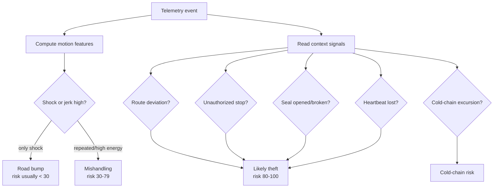
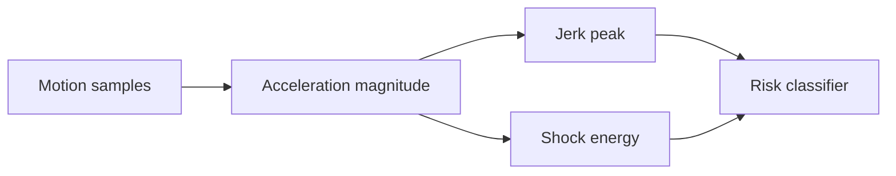
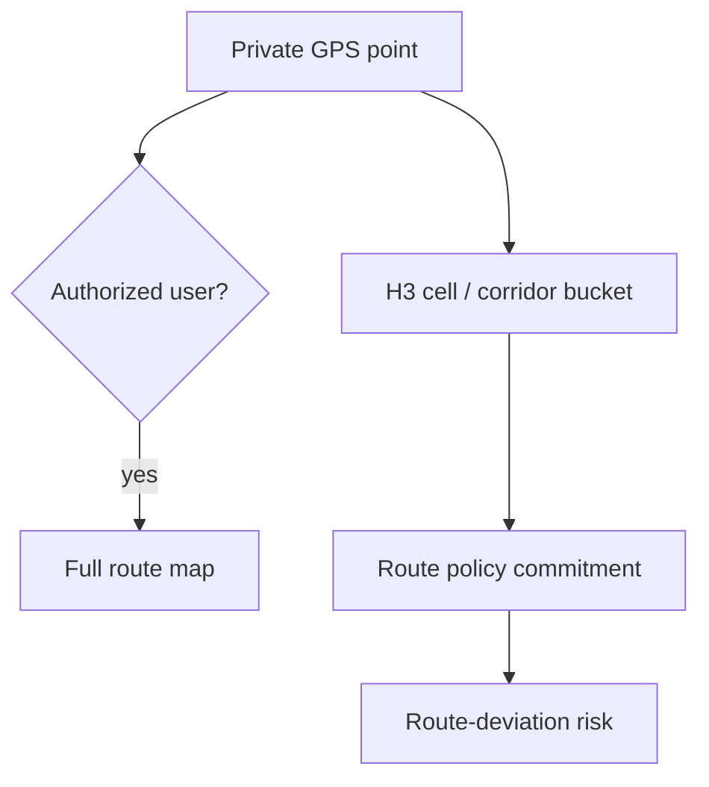
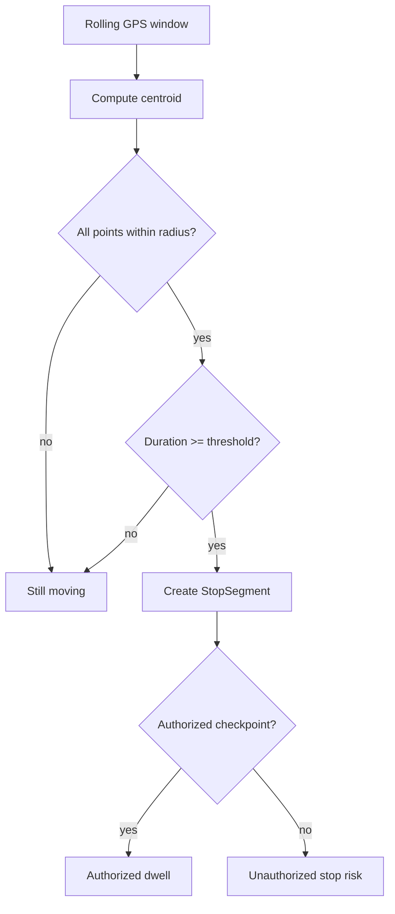
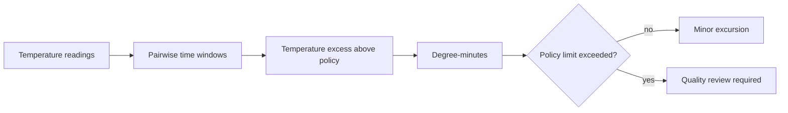
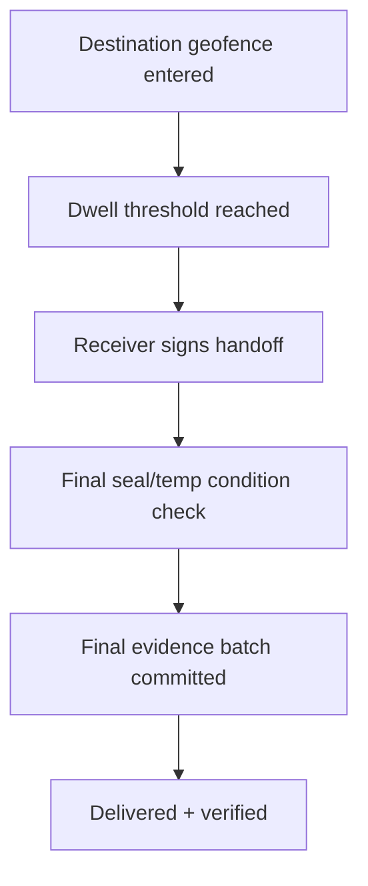

# Algorithms

This document explains the deterministic logic used by Monad Sentinel. The LLM layer is optional; these rules keep the demo explainable without an AI API key.

## Risk Classifier

Phone shaking is not treated as theft by itself. It is a **shock event**. Theft requires context such as route deviation, unauthorized dwell, seal break, or tracker silence.



Implementation: `packages/shared/src/index.ts` in `classifyCustodyRisk()`.

Risk additions:

```txt
shockEnergy > threshold           +25
repeated / high-energy shock      +15
large orientation change          +10
route deviation > 25m             +35
unauthorized dwell >= 180s        +35
seal break                        +50
heartbeat lost                    +30
cold-chain exposure               +25 to +45
manual theft simulation           +55
```

Severity:

```txt
0-29    normal
30-59   watch
60-79   suspicious
80-89   tamper
90-100  critical
```

## Motion Features

```txt
accelerationMagnitude = sqrt(ax^2 + ay^2 + az^2)
jerk                  = |a_t - a_(t-1)| / deltaSeconds
shockEnergy           = sum(max(0, accelerationMagnitude - baseline)^2 * deltaSeconds)
```



Demo scenarios:

- **Bump:** shock only, no route deviation, no seal break.
- **Mishandling:** repeated shock or cold-chain fluctuation, no custody breach.
- **Theft:** shock plus route deviation, unauthorized dwell, seal break, or heartbeat loss.

## Geofence and Route Deviation

Current hackathon mode uses indoor spatialization and simple distance checks. Production route validation should use PostGIS route corridors and H3 cell commitments.



Production-ready approach:

```sql
ST_DWithin(current_point, planned_corridor, allowed_distance_meters)
```

Privacy approach:

```txt
exact GPS                encrypted off-chain
route corridor cells     committed as routePolicyCommitment
public chain             only opaque commitment
```

## Stop and Dwell Detection

A stop is created when a rolling window stays inside a radius for long enough.



Default production starting point:

```txt
radius = 30 meters
minimum dwell = 180 seconds
```

Implementation: `detectStopSegment()` in `packages/shared/src/index.ts`.

## Cold-Chain Exposure

Temperature compliance should not be a single threshold crossing. The model uses degree-minutes:

```txt
exposureDegreeMinutes =
  sum(max(0, avgTemperature - maxAllowedTemperature) * deltaMinutes)
```



For a pharma demo policy:

```txt
allowed range: 2 C to 8 C
minor excursion: brief reading above 8 C
critical excursion: sustained exposure degree-minutes
```

## Delivery Confirmation

GPS alone does not prove delivery. Sentinel uses a delivery proof policy.



Delivery evidence:

```txt
deliveryEvidence = {
  shipmentCommitment,
  destinationCommitment,
  arrivalTime,
  dwellSeconds,
  receiverSignature,
  finalTemperatureState,
  finalSealState,
  finalBatchRoot
}
```

The contract exposes `DeliveryConfirmed` for the production path. The current UI shows the delivery proof steps on `/shipment/[shipmentId]`.
