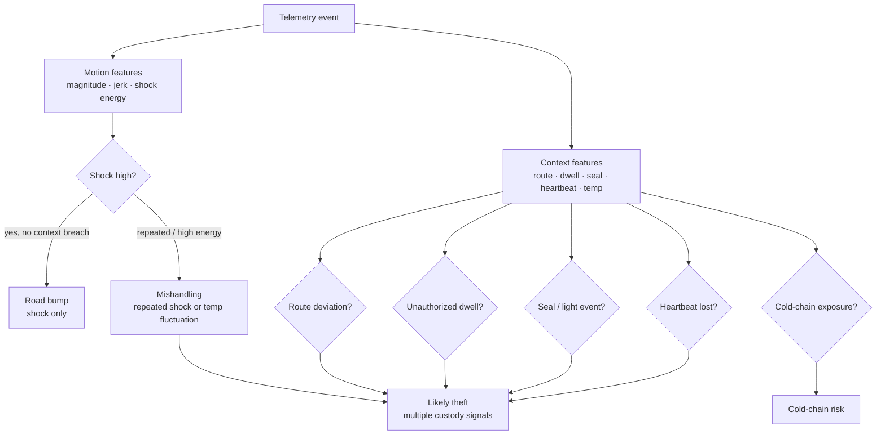
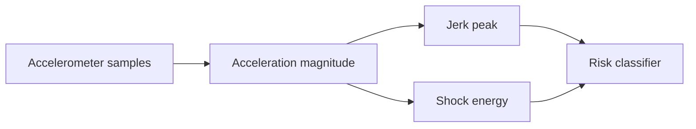
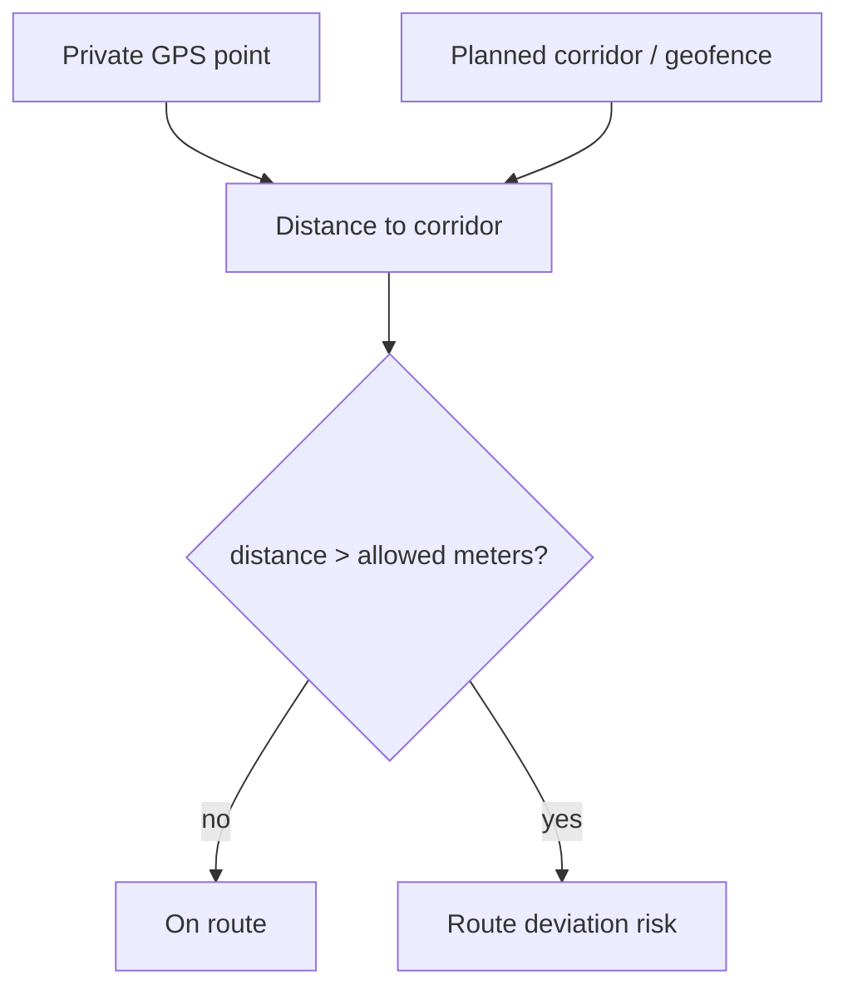
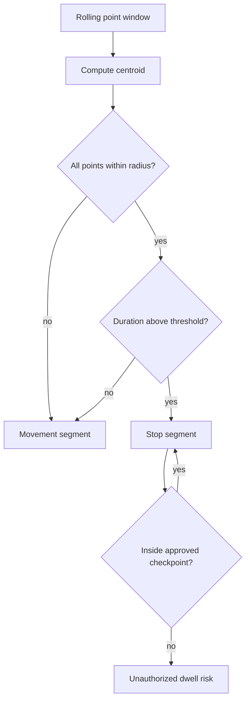
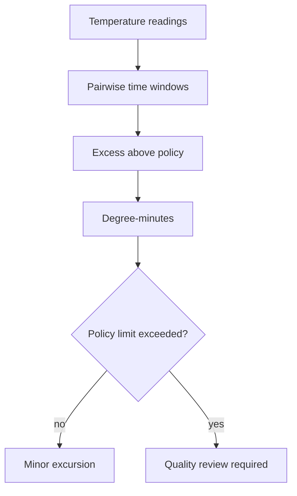
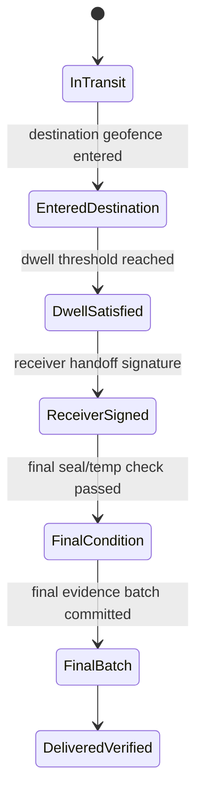
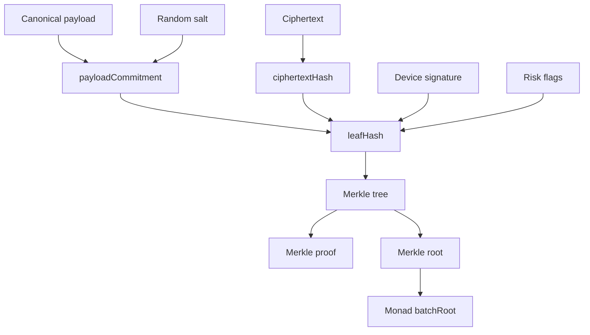
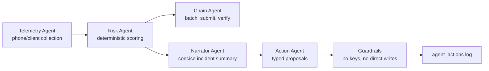

# Algorithms

Monad Sentinel is designed so judges can ask how the system works and receive deterministic answers. LLM narration is optional; the core classifications and proofs do not depend on model output.

## Risk Classification

A phone shake is a **shock event**, not automatically theft.



Current shared implementation: `packages/shared/src/index.ts`.

Severity bands:

```txt
0-29    normal
30-59   watch
60-79   suspicious
80-89   tamper
90-100  critical
```

## Motion Features

For each motion window:

```txt
accelerationMagnitude = sqrt(ax^2 + ay^2 + az^2)
jerk                  = |a_t - a_(t-1)| / deltaSeconds
shockEnergy           = sum(max(0, accelerationMagnitude - baseline)^2 * deltaSeconds)
```



Demo scenarios:

- **Bump:** shock only; no route deviation, unauthorized dwell, seal break, or silence.
- **Mishandling:** repeated shocks or temperature fluctuation; inspect cargo.
- **Likely theft:** shock plus route deviation, unauthorized stop, seal break, heartbeat loss, or missing handoff.

## Distance and Route Deviation

Haversine distance is used for lightweight checks and demos:

```txt
a = sin²(deltaLat / 2) + cos(lat1) * cos(lat2) * sin²(deltaLng / 2)
c = 2 * atan2(sqrt(a), sqrt(1-a))
distanceMeters = earthRadiusMeters * c
```



Production route validation path:

- PostGIS `ST_DWithin` for distance-to-corridor and destination geofence checks.
- H3 cells for privacy-preserving corridor commitments.
- OSRM or Valhalla for map matching noisy GPS traces to roads.

## Journey Map Layers

The MapLibre journey view renders authorized private route data, not public chain data.

```mermaid
flowchart LR
  DB[(Encrypted / authorized journey data)]
  Decode[Authorized route view builder]
  OSM[OSM raster base]
  Layers[MapLibre overlay sources]
  UI[/shipment/:shipmentId]

  DB --> Decode
  Decode --> Layers
  OSM --> UI
  Layers --> UI
```

Current overlays:

- planned route corridor
- actual route
- unauthorized deviation route
- destination geofence
- stop/dwell circles
- shock and temperature incident markers
- Monad batch anchor markers
- current position marker

## Stop and Dwell Detection

A stop is a rolling cluster of points that remains within a radius for a minimum duration.



Starting policy:

```txt
dwell radius: 30 meters
minimum dwell: 180 seconds
```

## Cold-Chain Exposure

Temperature compliance is based on exposure, not one noisy reading.

```txt
exposureDegreeMinutes =
  sum(max(0, avgTemperature - maxAllowedTemperature) * deltaMinutes)
```



For a pharma demo:

```txt
allowed range: 2 C to 8 C
brief 8.3 C spike: warning
sustained 11 C exposure: critical excursion
```

## Delivery Confirmation

Delivery is a policy state machine, not a single GPS point.



Delivery evidence:

```txt
deliveryEvidence = {
  shipmentCommitment,
  destinationCommitment,
  arrivalTime,
  dwellSeconds,
  receiverSignature,
  finalTemperatureState,
  finalSealState,
  finalBatchRoot
}
```

The journey page shows this policy even when the final production `DeliveryConfirmed` transaction is not enabled.

## Hashing and Merkle Proofs

The proof path is deterministic:



Why not hash raw GPS:

```txt
H(lat || lng || timestamp) is guessable.
H(randomSalt || canonicalPayload) is not useful without the salt.
H(ciphertext) proves the encrypted blob was not changed.
MerkleRoot(leafHash[]) proves the event was included in the committed batch.
```

## Agent Workflow

Agents are separated by responsibility.



The LLM layer is allowed to explain, summarize, and propose typed actions. It is not allowed to hold private keys or directly mutate chain/database state.
