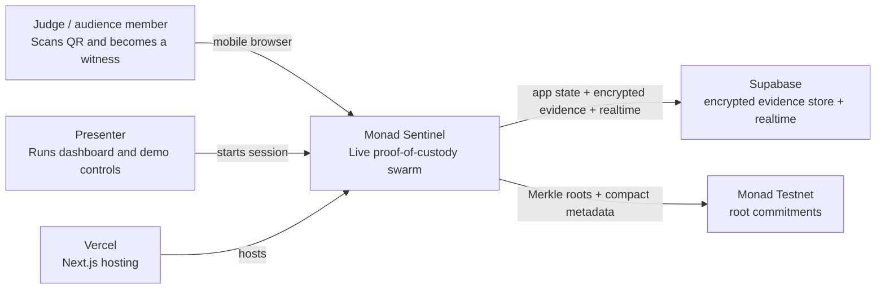
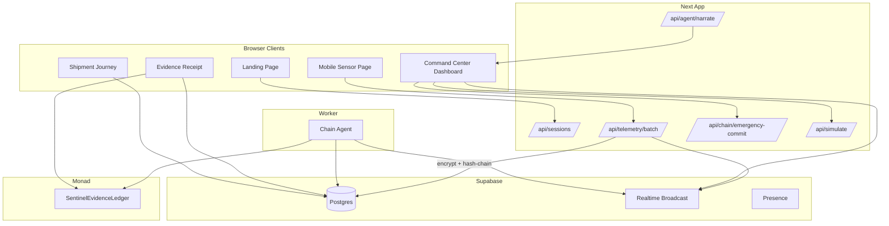
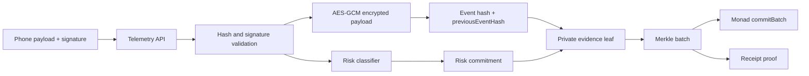
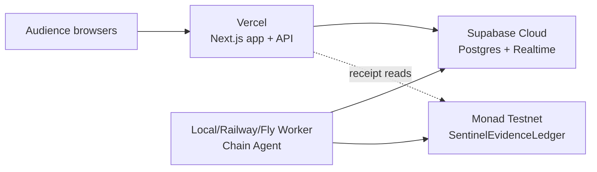
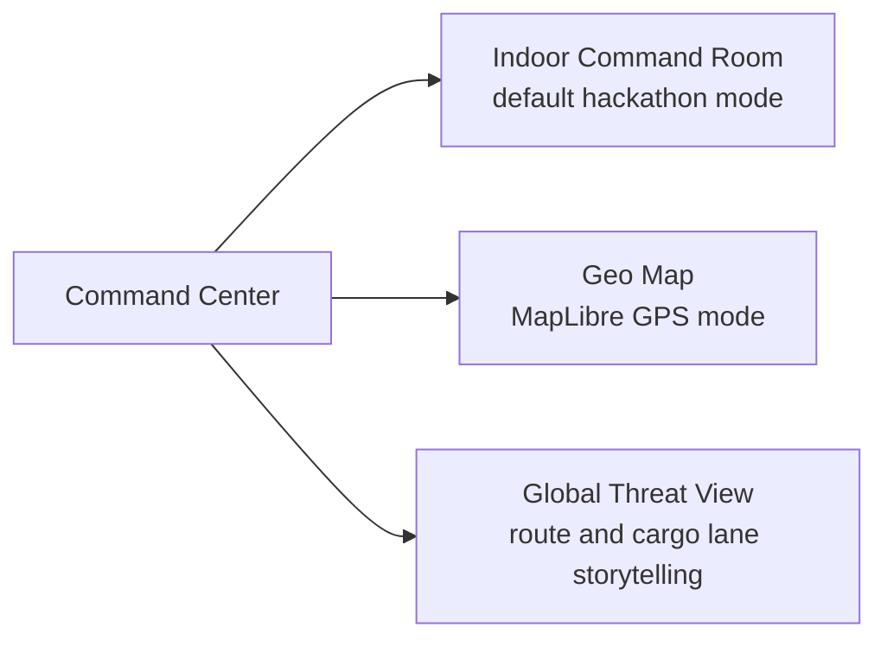

# Architecture

Monad Sentinel is built as four synchronized systems:

1. Human-facing demo system: QR, phone join, dashboard animation, sound, and simulation controls.
2. Realtime telemetry system: signed browser telemetry through Next.js API and Supabase Realtime.
3. Private evidence system: encrypted payload envelopes, hash-linked events, and selective reveal receipts.
4. Monad evidence system: Merkle batch roots committed by a gateway wallet to a Solidity ledger.

## System Context

## Runtime Components

## Data Flow

1. Presenter creates a session.
2. Dashboard validates its dashboard token and renders a QR to `/s/[sessionId]?t=[joinToken]`, using the public deployment origin in production.
3. Phone creates an ephemeral EVM key and derives a device ID.
4. Phone builds a telemetry payload, canonicalizes it, hashes it, signs EIP-712 typed data, and posts it to `/api/telemetry/batch`.
5. API validates the join token, recomputes the hash, recovers the signer, computes risk, encrypts the payload, creates a salted commitment, builds an event hash, and writes the row.
6. API broadcasts accepted telemetry and risk incidents to the dashboard.
7. Chain Agent or emergency-commit API polls unbatched rows, builds a Merkle tree, stores proofs, inserts a pending batch, then commits `commitBatch` to Monad when enabled.
8. Dashboard receives `chain.batch.committed` and updates the evidence rail.
9. Receipt page verifies encrypted evidence metadata, Merkle proof, and contract `batchRoot`.

## Why Supabase and Monad Both Exist

Supabase handles mutable, high-frequency, user-facing state:

- sessions
- devices
- encrypted telemetry rows
- online state
- incident rows
- Merkle proofs
- custody events and journey views
- chain outbox

Monad handles immutable evidence commitments:

- shipment commitments
- batch roots
- incident/delivery evidence events
- audit-friendly transaction hashes

The split keeps the demo responsive and avoids putting raw GPS, temperature, product, or customer identity on-chain.

## Private Evidence Flow

The public chain only receives `shipmentCommitment`, `merkleRoot`, counts, compact flags, a data availability hash, and a timestamp bucket.

## Deployment Topology

For hackathon reliability, run the Chain Agent locally or on a small worker host. It does not require public inbound traffic.

## Failure Modes and Fallbacks

- Bad indoor GPS: dashboard uses indoor spatialization while still signing real telemetry.
- Motion unavailable: phone shows a manual tamper button.
- Supabase unavailable: local simulation controls still demonstrate the command center.
- Monad RPC delayed: dashboard keeps showing signed/live state and marks chain batches pending.
- `CHAIN_DISABLED=true`: tx hashes are simulated and explicitly labeled as simulated.

## Viewport Modes

Indoor mode is the default because real GPS is unreliable inside event spaces.
