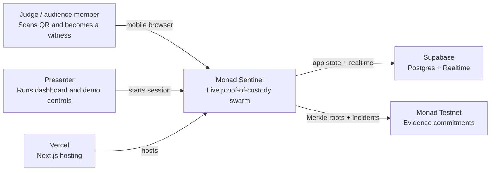
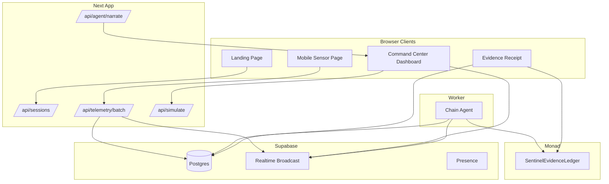
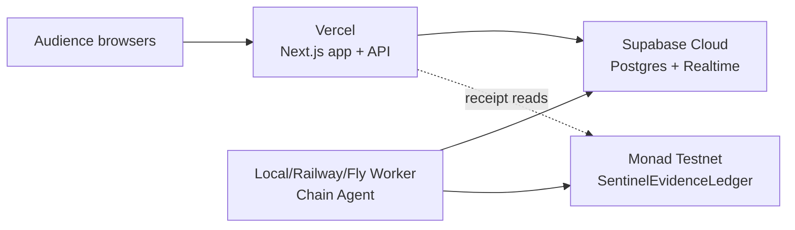

# Architecture

Monad Sentinel is built as three synchronized systems:

1. Human-facing demo system: QR, phone join, dashboard animation, sound, and simulation controls.
2. Realtime telemetry system: signed browser telemetry through Next.js API and Supabase Realtime.
3. Monad evidence system: Merkle batches committed by a gateway wallet to a Solidity ledger.

## System Context

## Runtime Components

## Data Flow

1. Presenter creates a session.
2. Dashboard renders a QR to `/s/[sessionId]`, using `NEXT_PUBLIC_APP_URL` in production.
3. Phone creates an ephemeral EVM key and derives a device ID.
4. Phone builds a telemetry payload, canonicalizes it, hashes it, signs EIP-712 typed data, and posts it to `/api/telemetry/batch`.
5. API recomputes the hash, recovers the signer, validates sequence/session, computes a risk score, writes rows, and broadcasts accepted telemetry.
6. Chain Agent polls unbatched rows, builds a Merkle tree, stores proofs, inserts a pending batch, then commits `commitBatch` to Monad when enabled.
7. Dashboard receives `chain.batch.committed` and updates the evidence rail.
8. Receipt page verifies event hash, signer, Merkle proof, and contract `batchRoot`.

## Why Supabase and Monad Both Exist

Supabase handles mutable, high-frequency, user-facing state:

- sessions
- devices
- telemetry rows
- online state
- incident rows
- Merkle proofs
- chain outbox

Monad handles immutable evidence commitments:

- session events
- device registration events
- batch roots
- incident evidence events
- audit-friendly transaction hashes

The split keeps the demo responsive and avoids putting raw GPS coordinates on-chain.

## Deployment Topology

For hackathon reliability, run the Chain Agent locally or on a small worker host. It does not require public inbound traffic.

## Failure Modes and Fallbacks

- Bad indoor GPS: dashboard uses indoor spatialization while still signing real telemetry.
- Motion unavailable: phone shows a manual tamper button.
- Supabase unavailable: local simulation controls still demonstrate the command center.
- Monad RPC delayed: dashboard keeps showing signed/live state and marks chain batches pending.
- `CHAIN_DISABLED=true`: tx hashes are simulated and explicitly labeled as simulated.
