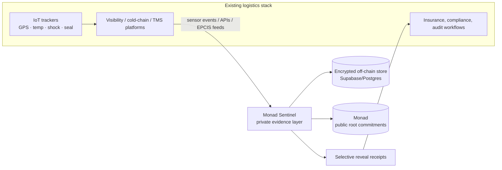
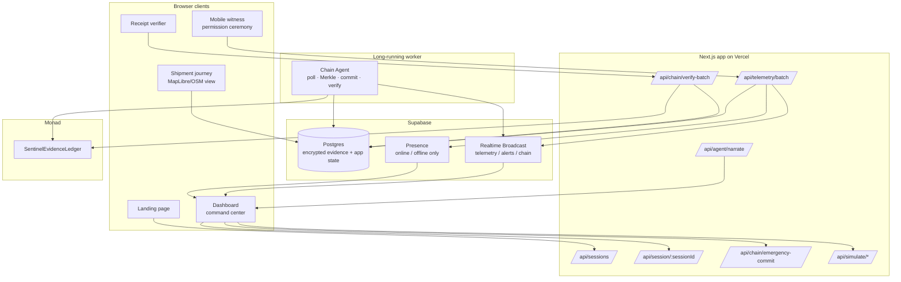
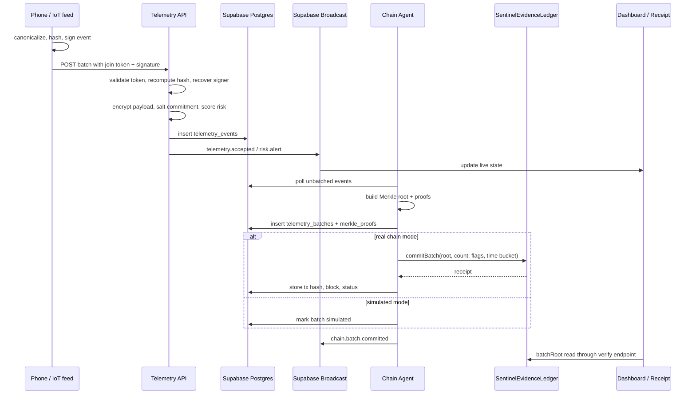
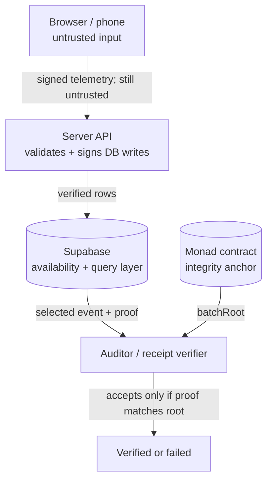
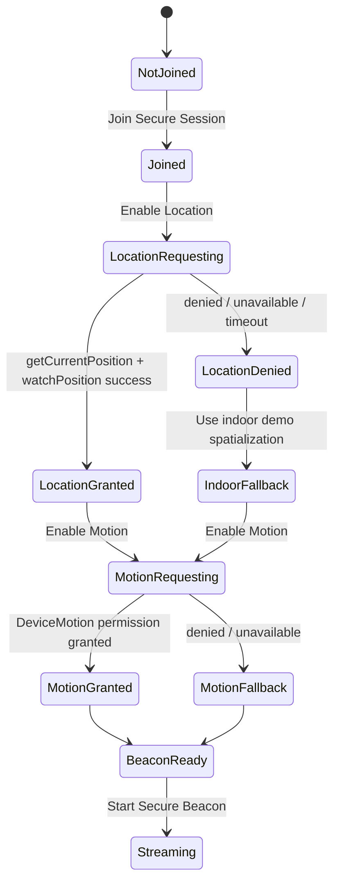
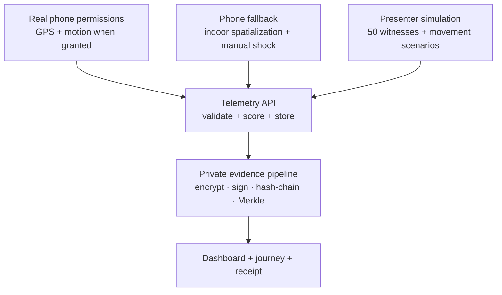
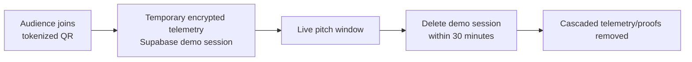
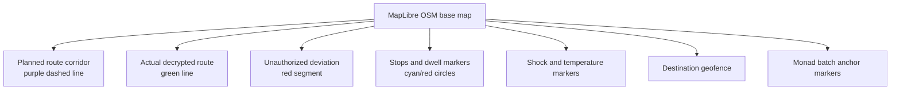
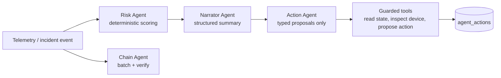
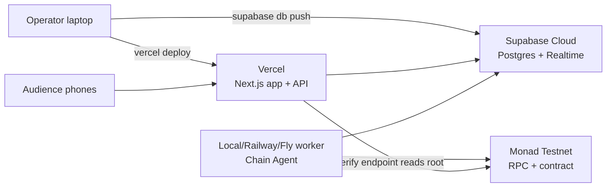

# Architecture

Monad Sentinel is a privacy-preserving evidence layer for logistics telemetry platforms. It does not replace shipment-visibility systems, IoT trackers, TMS/WMS products, or cold-chain dashboards. It sits underneath them and makes their telemetry privately verifiable.

## Strategic Context



The customer story:

```txt
Visibility platforms show what happened.
Monad Sentinel proves the evidence was not silently rewritten.
```

## Runtime Systems

Sentinel is built as five synchronized systems:

1. **Human-facing demo system:** landing page, QR join, mobile permission flow, command center, sounds, simulation controls.
2. **Realtime telemetry system:** phone/sensor events through Next.js API, Supabase Broadcast, and dashboard state.
3. **Private evidence system:** encrypted payloads, salted commitments, EIP-712 signatures, hash-linked events, Merkle proofs, receipts.
4. **Monad evidence system:** compact batch roots committed to `SentinelEvidenceLedger` and verified through RPC/contract reads.
5. **Demo reliability system:** indoor spatialization, simulated witnesses, presenter movement controls, and 30-minute demo data cleanup.



## Data Plane



## Trust Boundaries



Important distinction:

- **Integrity:** device signatures, previous-event hashes, Merkle proofs, Monad `batchRoot`.
- **Confidentiality:** AES-GCM encrypted payloads and no raw telemetry on-chain.
- **Availability:** Supabase today; production can replicate encrypted blobs to WORM/object/content-addressed storage.

## Supabase vs Monad

Supabase stores high-frequency state:

- sessions and join/dashboard tokens
- devices and presence
- encrypted telemetry events
- incidents and agent actions
- Merkle proofs and batch rows
- shipments, route policies, journey segments, delivery proofs

Monad stores compact public commitments:

- shipment commitments
- route/destination policy commitments
- Merkle roots by sequence
- incident evidence hashes
- delivery confirmation hashes

Supabase is not the trust anchor. If a row is edited after commitment, the receipt proof fails against the Monad root.

## Chain Verification

Explorer links are convenience only. Internal verification uses RPC and contract state:

```mermaid
flowchart TB
  Row[telemetry_batches row]
  Disabled{CHAIN_DISABLED=true<br/>or status simulated?}
  Tx[Fetch tx receipt<br/>eth_getTransactionReceipt]
  Decode[Decode BatchCommitted log]
  Contract[Read batchRoot(shipmentCommitment, sequence)]
  CompareLog{Log metadata matches DB?}
  CompareRoot{Contract root matches DB merkle_root?}
  Success[Mark verified]
  Sim[Simulated receipt only<br/>no explorer link]
  Fail[Pending / failed / mismatch]

  Row --> Disabled
  Disabled -->|yes| Sim
  Disabled -->|no| Tx
  Tx --> Decode
  Decode --> CompareLog
  CompareLog -->|no| Fail
  CompareLog -->|yes| Contract
  Contract --> CompareRoot
  CompareRoot -->|yes| Success
  CompareRoot -->|no| Fail
```

The implementation lives in `apps/web/app/api/chain/verify-batch/route.ts` and `apps/web/lib/chain/verification.ts`.

## Mobile Permission Flow

The mobile page requests browser sensors only from user gestures. Fallback states are explicit and not shown until a request fails or the user chooses indoor spatialization.



The helper implementation is `apps/web/lib/sensors/browserSensors.ts`.

## Demo Reliability Architecture

The demo cannot depend on perfect indoor GPS, perfect venue Wi-Fi, or every audience member granting sensor permissions. The system therefore has three input paths that converge into the same evidence pipeline.



Presenter controls are deterministic scenario generators for explaining thresholds:

- road bump: shock only, no custody breach
- mishandling: repeated shock or condition risk
- likely theft: shock plus route deviation, unauthorized dwell, seal risk, or heartbeat loss
- cold-chain breach: thermal exposure over product policy
- delivery: destination geofence, dwell threshold, receiver handoff, final condition, final evidence batch

Simulated chain mode remains clearly labeled. The UI must not link simulated hashes to Monad explorers or display **Verified on Monad** unless `/api/chain/verify-batch` succeeds against RPC and contract state.

## Demo Data Retention

Audience phone telemetry is temporary demo data. For hackathon sessions, the operator should purge demo rows within 30 minutes of capture.



This retention promise is separate from public proof anchoring:

- raw audience GPS is never written on-chain
- simulated-chain receipts are not public proof
- real-chain mode anchors only opaque Merkle roots and compact metadata
- screenshots should not expose audience routes or device identities

The current documented cleanup path is Supabase SQL deletion by demo session; automation should be treated as a pre-demo quality gate before promising unattended cleanup.

## Journey Map Layers

`/shipment/[shipmentId]` is the authorized logistics journey view. It uses MapLibre with an OpenStreetMap raster fallback and customer-authorized overlays.



The current view can build from real telemetry rows when available and falls back to a demo route so the page always explains the concept.

## Agentic Layer

The product is agentic only where agents improve interpretation or action routing. Deterministic agents remain the safety baseline.



Guardrails:

- LLMs never hold private keys.
- LLMs never directly write to DB or chain.
- LLM output must be structured and bounded.
- Dangerous actions require deterministic preconditions and typed tools.
- The current app has a deterministic narration fallback in `/api/agent/narrate`.

## Deployment Topology



For hackathon reliability, the Chain Agent can run locally. It needs outbound access only.

## Failure Modes

- **Bad GPS indoors:** use indoor spatialization, still sign the event.
- **Motion permission denied:** use manual shock fallback.
- **Supabase unavailable:** local simulation still demonstrates UI; real receipts require DB.
- **Monad delayed/unconfigured:** batches remain pending or simulated, never falsely verified.
- **Explorer outage:** internal RPC verification remains the source of truth.
- **LLM unavailable:** deterministic risk and narration keep working.
