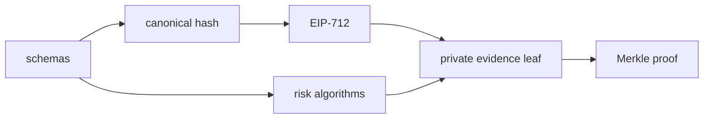
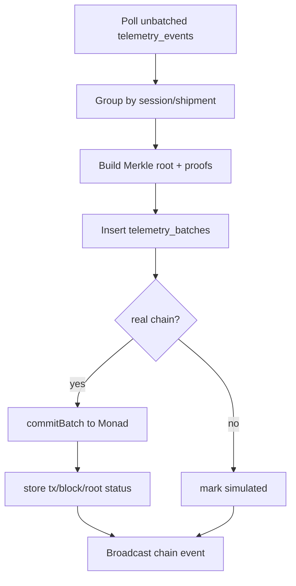

# Codebase Map

This map is organized around the current product truth: Sentinel is a private evidence layer for logistics telemetry.

## Root

- `README.md`: product overview, high-level diagrams, quick start.
- `.env.example`: expected environment variables. Do not put secrets in source.
- `package.json`: workspace scripts.
- `pnpm-workspace.yaml`: monorepo package layout.
- `scripts/sentinel.ts`: launch, verify, doctor, and reset helper.
- `docs/`: architecture, protocol, algorithms, decisions, runbook, judge Q&A.
- `AGENTS.md`: coding-agent guidance.

## `apps/web`

Next.js App Router application.

```mermaid
flowchart TB
  Page[app/page.tsx<br/>landing + session CTA]
  Dashboard[app/dashboard/[sessionId]]
  Sensor[app/s/[sessionId]]
  Shipment[app/shipment/[shipmentId]]
  Receipt[app/receipt/[sessionId]/[batchId]]
  API[app/api/*]

  Page --> Dashboard
  Dashboard --> Sensor
  Dashboard --> Shipment
  Dashboard --> Receipt
  Sensor --> API
  Dashboard --> API
  Receipt --> API
```

Important routes:

- `app/page.tsx`: public landing and session start.
- `app/dashboard/[sessionId]/DashboardClient.tsx`: command center shell, live store, QR, metrics, evidence rail, agent activity.
- `app/s/[sessionId]/SensorContent.tsx`: mobile witness page and permission ceremony.
- `app/shipment/[shipmentId]/page.tsx`: authorized journey and delivery proof view.
- `app/receipt/[sessionId]/[batchId]/page.tsx`: receipt verification UI.
- `app/api/sessions`: create a demo session and commitments.
- `app/api/session/[sessionId]`: dashboard-token session lookup and join token reveal.
- `app/api/telemetry/batch`: signed telemetry ingest.
- `app/api/chain/emergency-commit`: serverless demo batcher.
- `app/api/chain/verify-batch`: RPC/contract-root chain verifier.
- `app/api/simulate/*`: demo control helpers.
- `app/api/agent/narrate`: deterministic incident narrative fallback.

Important libraries:

- `lib/evidence/privateEvidence.ts`: encrypted evidence envelopes, salted commitments, event hashes, leaf generation.
- `lib/chain/verification.ts`: viem receipt/log/root verification.
- `lib/chain/explorer.ts`: explorer-link rules; simulated batches do not link.
- `lib/sensors/browserSensors.ts`: geolocation and DeviceMotion permission helpers.
- `lib/store/sentinelStore.ts`: dashboard state and local simulation.
- `lib/sound/SoundEngine.ts`: Web Audio-generated sound effects.
- `lib/supabase/*`: browser/server Supabase clients.
- `src/generated/contract.ts`: generated ABI/address used by frontend/server.

Components:

- `components/command/*`: dashboard panels, evidence rail, metrics, agent activity.
- `components/journey/JourneyMap.tsx`: MapLibre OSM journey map with route, stop, incident, batch anchor layers.
- `components/mobile/*`: mobile witness UI.
- `components/three/*`: indoor/globe visual components.

## `packages/shared`

Shared TypeScript protocol code used by the app and worker.

Responsibilities:

- telemetry schemas
- canonical JSON
- keccak payload hashes
- EIP-712 typed data helpers
- signer recovery
- private event commitments
- Merkle tree/proof functions
- risk classification
- motion, distance, dwell, and cold-chain helpers
- realtime event types



## `packages/contracts`

Foundry Solidity package.

- `src/SentinelEvidenceLedger.sol`: commitment ledger.
- `script/Deploy.s.sol`: deployment script.
- `test/SentinelEvidenceLedger.t.sol`: contract behavior tests.

Contract stores:

- shipment authority
- route/destination commitments
- Merkle roots by shipment and sequence
- incident evidence hashes
- delivery evidence hashes

Contract does not store:

- raw GPS
- route arrays
- temperatures
- product/customer names
- device identities

## `packages/chain-agent`

Long-running worker.



The serverless emergency commit route follows the same table/proof shape for demo safety.

## `supabase`

Migrations:

- `001_init.sql`: sessions, devices, telemetry events, batches, proofs, incidents, agent actions, chain outbox.
- `002_private_evidence.sql`: shipment/policy commitments, encrypted evidence columns, custody events, route policies, evidence receipts, dashboard-token join reveal.
- `003_journey_segments_delivery_proofs.sql`: journey segments and delivery proof policy tables.

Main tables:

- `sessions`
- `devices`
- `telemetry_events`
- `telemetry_batches`
- `merkle_proofs`
- `incidents`
- `agent_actions`
- `chain_outbox`
- `shipments`
- `route_policies`
- `custody_events`
- `evidence_receipts`
- `journey_segments`
- `delivery_proofs`

## Documentation Files

- `docs/architecture.md`: system architecture, trust boundaries, deployment, agent flow.
- `docs/protocol.md`: cryptographic evidence protocol and verification.
- `docs/algorithms.md`: deterministic risk, route, dwell, temperature, delivery logic.
- `docs/decisions.md`: ADRs and tradeoffs.
- `docs/runbook.md`: demo/deploy/doctor instructions.
- `docs/agentic-system.md`: deterministic agent fallback and model-tool guardrails.
- `docs/judge-qa.md`: concise answers for pitch and objections.

## Validation Commands

```bash
pnpm test
pnpm build
pnpm sentinel:verify
pnpm sentinel:doctor
pnpm contracts:test
```

`pnpm contracts:test` requires Foundry. `pnpm sentinel:verify` skips Solidity tests when `forge` is not installed.
