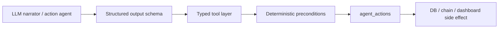

# System Decisions

These decisions capture what Monad Sentinel is today and why it is designed this way.

## ADR-001: Sentinel Is an Evidence Layer, Not a Tracker

**Decision:** Position Sentinel as a privacy-preserving proof layer for platforms that already collect logistics telemetry.

**Reasoning:**

- Shipment visibility, cold-chain, and fleet platforms already collect GPS, temperature, shock, seal, battery, scans, and handoff events.
- The missing layer is independently verifiable evidence for disputes, audits, claims, and compliance.
- This is more credible than claiming to replace existing tracker hardware and SaaS workflows.

**Tradeoff:** The product depends on integrations in production. The hackathon demo uses phones as sensor emulators.

## ADR-002: Use Monad for Evidence Commitments, Not Raw Telemetry

**Decision:** Commit Merkle roots and compact metadata to Monad. Never store raw GPS, temperature, product, customer, route, or device identity on-chain.

**Reasoning:**

- Raw logistics telemetry is commercially and physically sensitive.
- Even high-throughput chains should not receive one transaction per sensor packet.
- Batch roots provide scalable, public, tamper-evident anchors.

**Tradeoff:** Verification requires off-chain encrypted event rows and Merkle proofs.

## ADR-003: Private Evidence Anchoring

**Decision:** Store encrypted payloads, salted payload commitments, ciphertext hashes, risk commitments, and hash-linked event hashes off-chain.

**Reasoning:**

- A raw hash of GPS and time can be brute-forced against likely routes.
- Random salts make payload commitments opaque.
- Ciphertext hashes prove encrypted data was not modified.
- `previousEventHash` makes per-device journeys append-only from the verifier's perspective.

**Tradeoff:** Authorized dashboards need data-key access. Public verifiers can verify inclusion and commitment, but not inspect private telemetry unless it is selectively revealed.

## ADR-004: Supabase Is the Data Availability Layer

**Decision:** Use Supabase Postgres and Realtime for app state, encrypted evidence rows, proofs, incidents, and live dashboard updates.

**Reasoning:**

- Realtime Broadcast is suitable for live telemetry events.
- Presence is useful for online/offline device state.
- Postgres keeps receipts, journey views, and batch metadata queryable.
- Vercel API routes should not be treated as persistent WebSocket servers.

**Tradeoff:** Supabase is not the trust root. It can delete or hide data, but committed rows cannot be silently changed without breaking proof verification.

## ADR-005: Audience Phones Use Ephemeral Keys

**Decision:** The phone demo generates local EVM keys instead of requesting wallet connection.

**Reasoning:**

- Judges and audience members can join instantly through QR.
- No wallet popup, gas, tokens, or asset custody is required.
- The proof goal is signed sensor evidence, not user financial identity.

**Tradeoff:** Device identity is scoped to a session. Production trackers should use secure-element or hardware-backed keys.

## ADR-006: EIP-712 Typed Signatures

**Decision:** Sign typed telemetry records with EIP-712.

**Reasoning:**

- Typed data binds session, device, sequence, payload hash, and timestamp.
- Server-side recovery is deterministic.
- It is more explainable than opaque personal messages.

**Tradeoff:** EIP-712 adds implementation complexity, but it is the right model for structured evidence.

## ADR-007: Deterministic Agents First

**Decision:** Risk classification and narration must work without an LLM.

**Reasoning:**

- The live demo must survive model outages, latency, or missing API keys.
- Judges can inspect deterministic algorithms.
- LLMs are useful for summaries and proposals, not as the trust anchor.

**Tradeoff:** The fallback narration is less expressive, but it remains reliable.

## ADR-008: Guarded Agentic Actions

**Decision:** Optional AI agents can call typed tools only. They cannot directly write to the database or chain.

**Reasoning:**

- Private logistics data and chain actions are high-risk.
- Tool logs make agent behavior auditable.
- Dangerous actions require deterministic evidence, not model confidence alone.

**Tradeoff:** Fully autonomous behavior is intentionally constrained until guardrails are extended.

## ADR-009: Indoor Mode Is the Demo Default

**Decision:** Use indoor spatialization and a 3D command room as the default dashboard view.

**Reasoning:**

- Indoor browser GPS is unreliable.
- Hackathon demos need a vivid, deterministic visual.
- The phone can still sign real permission states and telemetry.

**Tradeoff:** Indoor mode is not a literal route map. The journey page provides MapLibre/OSM route visualization.

## ADR-010: MapLibre Journey View for Authorized Routes

**Decision:** Use MapLibre with OpenStreetMap-derived raster fallback for `/shipment/[shipmentId]`.

**Reasoning:**

- The journey view needs a real map, route overlays, geofence, stops, incident markers, and batch anchors.
- MapLibre is WebGL-capable and supports live GeoJSON sources.
- The OSM raster fallback avoids requiring a paid tile key for demos.

**Tradeoff:** Production should use a proper OSM-derived provider, PMTiles, or self-hosted tiles rather than relying on public tile servers for heavy traffic.

## ADR-011: Chain Verification Does Not Trust Explorers

**Decision:** Internal verification uses viem RPC calls, decoded contract logs, and `batchRoot()` reads. Explorers are convenience links only.

**Reasoning:**

- Explorers can be delayed, down, or pointed at the wrong network.
- Verification must work from first principles.
- Receipts should only become green when contract state matches the local Merkle root.

**Tradeoff:** The app needs `MONAD_RPC_URL` and contract address for real verification.

## ADR-012: Simulated Chain Mode Must Be Explicit

**Decision:** When `CHAIN_DISABLED=true` or a batch is marked simulated, the UI disables explorer links and does not show "Verified on Monad".

**Reasoning:**

- Simulated mode is useful for demos and development.
- Fake hashes must never be presented as real chain proof.
- The same off-chain protocol still exercises hashing, encryption, Merkle proofs, and receipts.

**Tradeoff:** Local demos show "simulated receipt only" until real chain env is configured.

## ADR-013: Chain Agent Is a Worker

**Decision:** Batching and Monad transaction submission belong in a long-running worker, with serverless emergency commit as a demo safety net.

**Reasoning:**

- Batching needs polling, retries, receipt handling, and nonce awareness.
- Vercel functions are not persistent workers.
- The emergency endpoint keeps the demo functional if the worker is not running.

**Tradeoff:** Production deployment needs one extra process.

## ADR-014: Delivery Requires a Policy

**Decision:** Delivery confirmation requires geofence, dwell, receiver handoff, final condition check, and final evidence commitment.

**Reasoning:**

- GPS alone is not proof of delivery.
- Custody and condition matter in pharma, food, medical, and high-value freight.
- The contract supports `DeliveryConfirmed` for the production path.

**Tradeoff:** The hackathon UI can show policy state before every production integration is complete.
