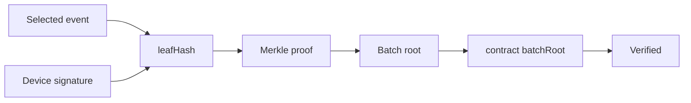

# Judge Q&A

## What is Monad Sentinel?

Monad Sentinel is a privacy-preserving evidence layer for supply-chain IoT and logistics-visibility platforms.

It turns existing GPS, temperature, shock, seal, battery, scan, and custody events into encrypted, signed, hash-chained, Merkle-batched evidence receipts anchored to Monad.

## Is this another GPS tracker?

No. Existing tracker and visibility platforms already collect telemetry. Sentinel adds the verifiability layer underneath them.

Short version:

```txt
They help you monitor.
Sentinel helps you prove.
```

## Why not put every GPS point on-chain?

We do not put raw GPS on-chain.

```txt
raw telemetry       encrypted off-chain
device event        signed by device key
event sequence      hash-linked
batch               Merkle root
Monad               opaque root + compact metadata
receipt             selective reveal verification
```

The public sees proof that evidence existed and was committed. It does not see routes, customers, products, exact locations, or temperature timelines.

## Then why use Monad at all?

Supabase makes the data available and realtime. Monad anchors the evidence root.

If someone edits a committed telemetry event later, the receipt no longer matches:

```txt
event hash -> Merkle proof -> batch root -> Monad batchRoot
```

Monad is the public integrity rail. It does not make GPS faster, and it is not used as the realtime database.

## What exactly is public on Monad?

```txt
shipmentCommitment
batchSequence
merkleRoot
sampleCount
maxRiskScore
combinedFlags
dataAvailabilityHash
timeBucket
tx hash
```

Not public:

```txt
exact GPS
route geometry
temperature readings
shock waveform
device identity
customer identity
product identity
driver identity
receiver identity
```

## Are audience phone locations stored permanently?

No. Audience phones are demo sensors, not production shipment devices.

Demo policy:

```txt
temporary tokenized session
encrypted/signed telemetry for the live demo
purge demo session within 30 minutes
no raw audience GPS on-chain
no audience route data in public screenshots
```

The presenter should say this before the QR scan. The operational runbook includes Supabase cleanup SQL for deleting demo sessions and their cascaded telemetry rows. In production, retention is a customer policy decision; for hackathon participation, the promise is temporary collection and prompt deletion.

## What if people deny location access?

The demo still works.

The mobile flow first asks for explicit permission from a user gesture. If the browser denies location or motion, the user can choose indoor spatialization and manual shock fallback. That fallback still produces a signed witness event with a clear permission state, so the dashboard can show:

```txt
real phone joined
GPS denied or fallback chosen
indoor spatialized position
signed telemetry packet
shock / movement simulation if needed
```

This is realistic because indoor GPS is unreliable even in legitimate deployments. The important claim is not "every phone always gives perfect GPS." The claim is "every accepted observation is signed, committed, and verifiable."

## What if nobody scans the QR?

The presenter can press **Spawn 50 witnesses** and run the same pitch through simulated devices. The simulation exists for demo reliability and load testing.

Use this wording:

> "These are simulated witnesses going through the same evidence pipeline so I can show scale. Real phones can join the same session from the QR."

The presenter controls also simulate:

- road bump: shock only, no custody breach
- mishandling: repeated shock or condition risk
- likely theft: shock plus route deviation, unauthorized dwell, seal risk, or silence
- cold-chain excursion
- emergency evidence batch
- delivery-policy checks on the journey page

Simulation is acceptable for UX and risk-flow demonstration. It must not be represented as a real Monad transaction unless real-chain verification succeeds.

## Why are salted commitments necessary?

This is unsafe:

```txt
H(latitude || longitude || timestamp)
```

GPS routes and timestamps are guessable. A bad actor can test likely route points.

Sentinel uses:

```txt
payloadCommitment = H(randomSalt || canonicalPayload)
ciphertextHash = H(AES-GCM encrypted payload)
leafHash = H(eventHash || signature || riskCommitment)
```

The public commitment is opaque without the salt and authorized payload.

## If Supabase stores the data, can an admin tamper with it?

They can delete or hide data, but they cannot silently rewrite committed history without breaking verification.

```txt
Integrity        signatures + hash chain + Merkle root on Monad
Confidentiality  encryption + key control
Availability     Supabase today; WORM/object/content-addressed replication later
Tamper evidence  receipt proof fails if data is modified
```

In production, encrypted evidence blobs can be replicated to S3 Object Lock, R2, customer-owned storage, IPFS/Filecoin, or Arweave.

## What if a judge says the chain link is simulated?

That is clearly labeled.

When `CHAIN_DISABLED=true`:

- receipt says **Simulated receipt only**
- verify endpoint returns `mode: "simulated"` and `verified: false`
- explorer links are disabled
- UI must not say **Verified on Monad**

Real verification requires Monad RPC, deployed contract, real tx receipt, decoded `BatchCommitted`, and contract `batchRoot` equality.

## Can you show an actual transaction on Monad?

Yes, but only in real-chain mode.

Requirements:

```txt
CHAIN_DISABLED=false
NEXT_PUBLIC_CHAIN_MODE=real
MONAD_RPC_URL configured
gateway wallet funded
SentinelEvidenceLedger deployed
commitBatch transaction included
/api/chain/verify-batch returns verified=true
receipt contract root matches DB Merkle root
```

A real transaction screenshot should show the transaction hash, contract address, `BatchCommitted` event, and the receipt page showing root verification. Do not use a simulated batch or fake hash for this. If real chain mode is not configured, the honest screenshot is the simulated receipt guardrail.


## Why use phones in the demo?

Phones emulate sensor devices so the room can participate.

```txt
phone GPS            GNSS/cellular tracker location
phone accelerometer  shock/tamper sensor
phone battery        tracker battery health
QR scan              shipment provisioning
ephemeral signer     hardware-backed tracker key in production
phone shake          physical shock simulation
```

The important part is the protocol: each observation is signed, encrypted, linked, batched, and anchored.

## Does shaking a phone mean theft?

No. A shake means **shock detected**.

Theft requires context:

```txt
shock + route deviation
shock + unauthorized stop
seal break + movement
tracker silence + route anomaly
destination mismatch
missing receiver handoff
```

The dashboard separates:

- road bump
- mishandling
- likely theft

That is why the product is more credible than a simple "shake equals robbery" demo.

## How do you know a shipment arrived?

Delivery is confirmed by policy, not GPS alone:

```txt
destination geofence entered
dwell threshold reached
receiver signs handoff
final condition check passes
final evidence batch committed
```

The contract supports `DeliveryConfirmed` for production evidence.

## How do movement and deviation thresholds work in the demo?

For the live pitch, phones can stream real permission state and motion events, while the presenter can simulate route movement to avoid relying on indoor GPS.

The logic being demonstrated:

```txt
normal movement     stays inside planned route corridor
route deviation     crosses threshold from planned corridor
unauthorized dwell  stays outside approved area beyond dwell time
delivery            destination geofence + dwell + receiver handoff + final condition
```

This lets the judge see the source-to-destination journey and the difference between a harmless bump and a custody breach.


## Can criminals infer routes from transaction timing?

Metadata leakage is real. Mitigations include:

```txt
fixed cadence batching
padded batches
aggregated roots for many shipments
pseudonymous shipment commitments
delayed public incident reveal
gateway address rotation where appropriate
```

The demo already avoids public raw route, product, and customer data.

## Why not just use a private database audit log?

A private audit log is useful, but users still trust the platform operator. Sentinel gives the database an external integrity anchor.

```txt
private DB only       useful but trust-dependent
raw chain telemetry   verifiable but unsafe
encrypted DB + roots  private and verifiable
```

## How does the receipt prove an event?



The UI shows green verification only when the event proof and chain root match.

## Why is Monad a good fit?

Sentinel needs an EVM-compatible audit rail for frequent compact commitments. The app does not need every telemetry packet to be a transaction. It needs fast, low-friction, public batch roots and standard Solidity tooling.

The technical claim is:

```txt
Every second can be tracked privately.
Every batch can be proven publicly.
```

## Is this production realistic?

Yes, if positioned correctly.

Production integrations:

- existing tracker APIs
- sensor gateways
- webhooks
- TMS/WMS systems
- GS1 EPCIS-style events
- cold-chain and claims systems

The phone demo is the room-scale emulator, not the final industrial hardware story.

## What is the AI agent role?

Agents assist with interpretation and workflow, not trust.

```txt
Telemetry Agent    collects and queues sensor observations
Risk Agent         deterministic classification
Chain Agent        Merkle batching and chain verification
Narrator Agent     concise incident summaries
Action Agent       typed proposals behind guardrails
```

Guardrails:

- no private keys in model context
- no direct DB or chain writes from LLM output
- deterministic fallback required
- structured JSON outputs
- every tool call logged

## What is the ZK roadmap?

The MVP uses selective reveal receipts. Future zero-knowledge proofs can prove facts without revealing raw telemetry:

```txt
temperature stayed within 2 C to 8 C
locations stayed inside approved H3 route cells
final point was inside destination geofence
no unauthorized dwell segment occurred
```

H3 route cells plus a Merkle root of allowed cells are a practical route-compliance path.

## Best final pitch

> Monad Sentinel is not another tracker. It is the private evidence layer for companies that already track shipments. We encrypt the raw telemetry, sign each event, hash-chain the journey, batch events into Merkle roots, and anchor only those roots to Monad. Customers see the full journey. Auditors get verifiable receipts. Attackers get no public route data.
