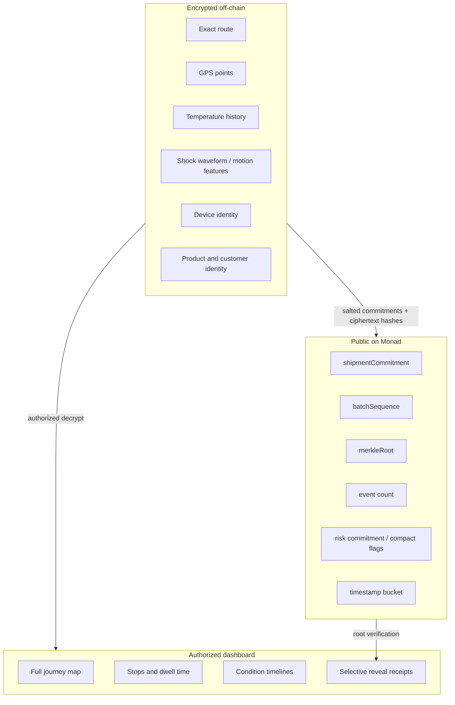
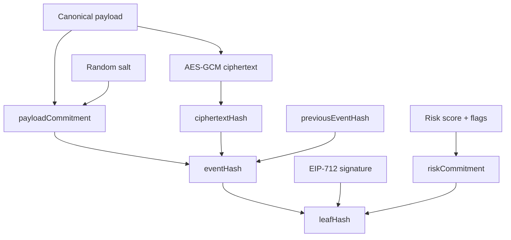
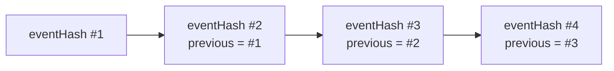
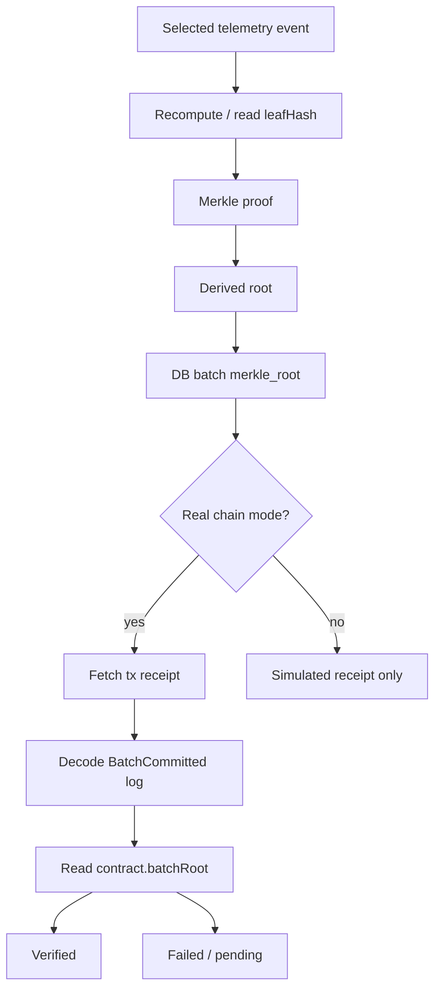

# Private Evidence Protocol

The Sentinel protocol turns logistics telemetry into private, tamper-evident evidence.

It is intentionally not:

```txt
H(latitude || longitude || timestamp) on-chain
```

That leaks too much. GPS and timestamps have a guessable search space. A motivated attacker could test likely routes.

Sentinel instead uses:

```txt
encrypted payloads
+ random salts
+ device signatures
+ previous-event hashes
+ Merkle batch roots
+ Monad batchRoot verification
```

## Public / Private Split



## Commitments

Per shipment:

```txt
shipmentCommitment    = H(shipmentSecret || shipmentId)
routePolicyCommitment = H(routeSecret || allowedRouteCells)
destinationCommitment = H(destinationSecret || destinationGeofence)
```

The public chain sees commitments, not names, routes, origins, destinations, products, or customers.

Per device:

```txt
devicePrivateKey  = ephemeral local key in demo, hardware key in production
deviceAddress     = EVM address recovered from signature
devicePseudonym   = H(shipmentSecret || deviceAddress)
```

Phones use ephemeral local keys so audience members do not need wallets, tokens, or asset custody.

## Event Lifecycle

```mermaid
sequenceDiagram
  participant Sensor as Phone / IoT sensor
  participant API as Telemetry API
  participant DB as Supabase
  participant Batch as Chain Agent
  participant Monad as SentinelEvidenceLedger
  participant Receipt as Receipt verifier

  Sensor->>Sensor: Build telemetry payload
  Sensor->>Sensor: canonicalJson(payload)
  Sensor->>Sensor: payloadHash = keccak256(canonicalJson)
  Sensor->>Sensor: EIP-712 sign typed event
  Sensor->>API: POST /api/telemetry/batch
  API->>API: Recompute payloadHash
  API->>API: Recover signer and validate sequence
  API->>API: Encrypt payload + create commitments
  API->>DB: Store telemetry_events row
  Batch->>DB: Read unbatched leaf hashes
  Batch->>Batch: Build Merkle root + proofs
  alt real chain mode
    Batch->>Monad: commitBatch(root)
  else simulated mode
    Batch->>DB: Mark simulated; no explorer link
  end
  Receipt->>DB: Read event + proof + batch
  Receipt->>Monad: Read batchRoot when real chain mode
```

## EIP-712 Signature

The phone signs typed data:

```ts
Telemetry(
  bytes32 sessionId,
  bytes32 deviceId,
  uint64 seq,
  bytes32 payloadHash,
  uint256 clientTimestampMs
)
```

Server validation:

1. Validate QR join token.
2. Recompute canonical payload hash.
3. Recover EIP-712 signer.
4. Ensure recovered address matches `deviceAddress`.
5. Enforce monotonic sequence per device.
6. Compute private evidence envelope.
7. Store and broadcast accepted event.

## Private Evidence Envelope

The ingest API produces an envelope with these values:

```txt
canonicalPayload   = stable JSON serialization of sensor event
payloadSalt        = random 32 bytes
payloadCommitment  = H(payloadSalt || canonicalPayload)
ciphertext         = AES-GCM(dataKey, canonicalPayload, associatedData)
ciphertextHash     = H(ciphertext)
riskCommitment     = H(payloadSalt || riskScore || riskFlags || class || reason)
eventHash          = H(domain || shipmentCommitment || devicePseudonym || seq ||
                       timestamp || payloadCommitment || ciphertextHash ||
                       previousEventHash)
leafHash           = H(eventHash || H(signature) || riskCommitment)
```



AES-GCM gives confidentiality and ciphertext integrity. The receipt uses hashes and proofs; authorized users can additionally decrypt the journey.

## Hash Chain

Each event includes the prior event hash for that device journey.



Editing or inserting a historical event changes every downstream hash. The Merkle root then fails verification.

## Merkle Batch

The batcher sorts events deterministically and builds a Merkle tree over `leafHash`.

```mermaid
flowchart TB
  L1[leaf 1] --> P12[H(L1 || L2)]
  L2[leaf 2] --> P12
  L3[leaf 3] --> P34[H(L3 || L4)]
  L4[leaf 4] --> P34
  P12 --> Root[Merkle root]
  P34 --> Root
  Root --> Batch[telemetry_batches.merkle_root]
  Root --> Contract[commitBatch]
```

If the number of leaves is odd, the implementation duplicates the last leaf at that level so every level can be paired.

## On-Chain Contract Call

Production call shape:

```solidity
commitBatch(
  bytes32 shipmentCommitment,
  uint64 sequence,
  bytes32 merkleRoot,
  uint32 sampleCount,
  uint16 maxRiskScore,
  uint16 combinedFlags,
  bytes32 dataAvailabilityHash,
  uint256 timeBucket
)
```

Only the authority that created a shipment can commit batches for that shipment.

## Receipt Verification



The receipt can show **Verified on Monad** only when all are true:

- batch is not marked simulated
- `CHAIN_DISABLED=false`
- Monad RPC and contract address are configured
- tx receipt exists and succeeded
- decoded `BatchCommitted` event matches DB metadata
- `batchRoot(shipmentCommitment, sequence)` equals the local Merkle root

## Simulated Mode Guardrails

Simulated mode is useful for local demos and cloud smoke tests. It is not chain proof.

Rules:

- Batch status is `simulated`.
- Verification endpoint returns `mode: "simulated"` and `verified: false`.
- Receipts say **Simulated receipt only**.
- Explorer links are disabled.
- The UI must not say **Verified on Monad** for simulated batches.

This keeps the demo honest while still proving the off-chain protocol mechanics.

## Selective Reveal

A verifier does not need the whole route. They can receive:

- selected plaintext payload, when authorized
- payload salt
- ciphertext or ciphertext hash
- device signature metadata
- Merkle proof
- batch metadata
- Monad tx hash and contract root, in real chain mode

The verifier recomputes the selected event proof and checks it against the public root. Unselected GPS points and product details remain private.
