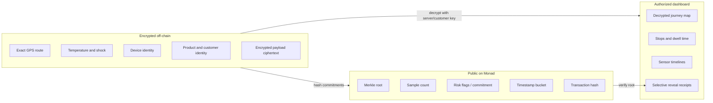
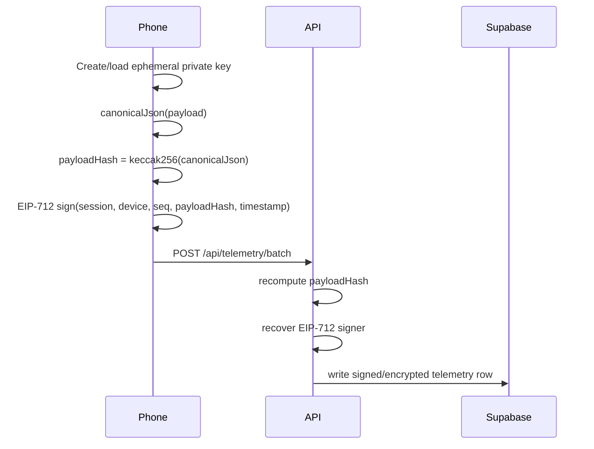
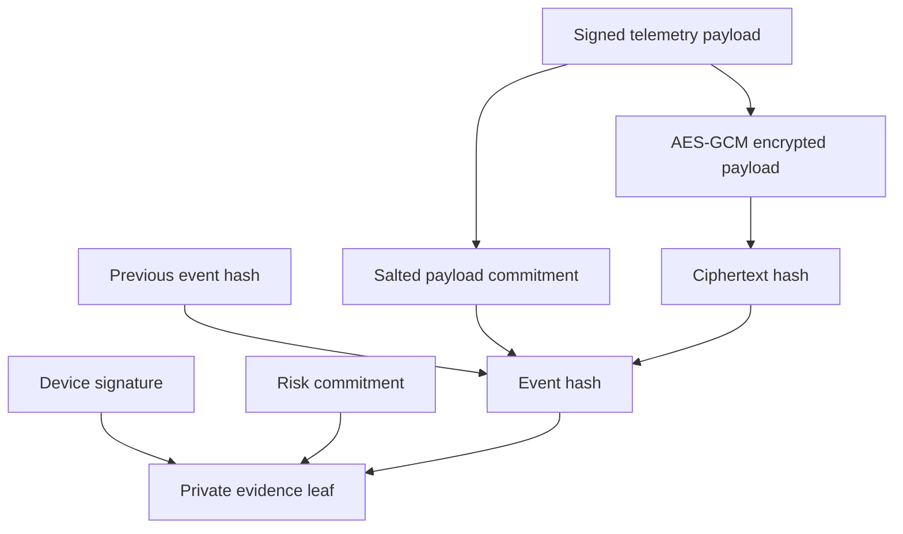
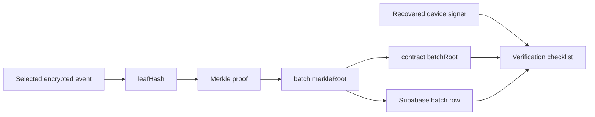

# Private Evidence Protocol

Monad Sentinel does not put raw GPS or condition telemetry on-chain. It uses **private evidence anchoring**:

```txt
encrypted off-chain telemetry
+ device signatures
+ hash-linked events
+ Merkle batch roots on Monad
= private, verifiable, tamper-evident custody evidence
```

## What Is Public vs Private



## Per-Session Commitments

The app creates a public shipment commitment and policy commitments. The real session ID and route remain private.

```txt
shipmentCommitment        = H(shipmentSecret || shipmentId)
routePolicyCommitment     = H(routeSecret || allowedRouteCells)
destinationCommitment     = H(destinationSecret || destinationGeofence)
```

Current implementation:

- `apps/web/app/api/sessions/route.ts` creates the session, commitments, demo shipment, and route policy.
- `sessions.join_token` is stored server-side so the dashboard can render a tokenized QR after validating the dashboard token.
- `join_token_hash` and `dashboard_token_hash` remain the validation anchors.

## Client Telemetry Signature

Audience phones do not connect wallets. The mobile page creates an ephemeral local EVM key and signs EIP-712 typed telemetry.



EIP-712 message:

```ts
Telemetry(
  bytes32 sessionId,
  bytes32 deviceId,
  uint64 seq,
  bytes32 payloadHash,
  uint256 clientTimestampMs
)
```

The API rejects payload-hash mismatches and signature-address mismatches.

## Private Evidence Envelope

At ingest, the server builds a private evidence envelope.

```txt
payloadSalt        = random(32 bytes)
payloadCommitment  = H(payloadSalt || canonicalPayload)
ciphertext         = AES-GCM-Encrypt(dataKey, canonicalPayload, associatedData)
ciphertextHash     = H(ciphertext)
eventHash          = H(domain || shipmentCommitment || devicePseudonym || seq ||
                       timestamp || payloadCommitment || ciphertextHash || previousEventHash)
riskCommitment     = H(payloadSalt || riskScore || riskFlags || eventClass || reason)
leafHash           = H(eventHash || H(signature) || riskCommitment)
```



Why salted commitments matter: a hash of `lat || lng || timestamp` can be brute-forced against likely routes. A random salt plus ciphertext hash makes the public commitment opaque.

## Hash Chain

Each event carries `previousEventHash`. That makes each device journey append-only from the verifier's perspective.

```txt
event #10 includes previousEventHash = eventHash #9
event #11 includes previousEventHash = eventHash #10
```

If an event is modified or inserted later, the chain no longer verifies.

## Merkle Batching

The chain agent or serverless emergency endpoint batches private evidence leaves.

```mermaid
flowchart TB
  L1[leafHash 1] --> P1[H(L1 || L2)]
  L2[leafHash 2] --> P1
  L3[leafHash 3] --> P2[H(L3 || L4)]
  L4[leafHash 4] --> P2
  P1 --> Root[Merkle root]
  P2 --> Root
  Root --> Contract[SentinelEvidenceLedger.commitBatch]
```

Monad receives:

```solidity
commitBatch(
  bytes32 shipmentCommitment,
  uint64 sequence,
  bytes32 merkleRoot,
  uint32 sampleCount,
  uint16 maxRiskScore,
  uint16 combinedFlags,
  bytes32 dataAvailabilityHash,
  uint256 timeBucket
)
```

Monad does not receive exact GPS, customer identity, product identity, temperature readings, or device addresses.

## Receipt Verification

The receipt page verifies the selected event against the batch.



Checklist:

1. Payload commitment exists for selective reveal.
2. Ciphertext hash matches the encrypted evidence envelope.
3. Device signature was recovered at ingest.
4. Merkle proof derives the batch root.
5. When `CHAIN_DISABLED=false`, contract `batchRoot(shipmentCommitment, sequence)` equals the receipt root.

In local/cloud demo mode with `CHAIN_DISABLED=true`, the UI says **simulated chain mode** and does not pretend the hash is a real Monad transaction.
