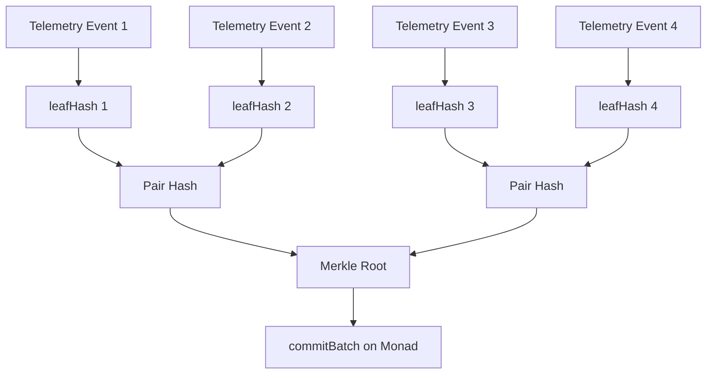

# Telemetry and Evidence Protocol

The core protocol goal is to turn browser observations into tamper-evident evidence without requiring audience wallets.

## Telemetry Payload

Phones send a structured payload:

```ts
type TelemetryPayload = {
  version: 1;
  sessionId: string;
  deviceId: string;
  deviceAddress: `0x${string}`;
  seq: number;
  capturedAt: number;
  latE7: number | null;
  lngE7: number | null;
  accuracyCm: number | null;
  accelX?: number | null;
  accelY?: number | null;
  accelZ?: number | null;
  batteryPct?: number | null;
  charging?: boolean | null;
  deviceClass: "mobile" | "tablet" | "desktop" | "unknown";
  browserHints: {
    platform?: string;
    touch: boolean;
    screenW: number;
    screenH: number;
  };
  riskFlags: number;
};
```

Raw telemetry can be stored temporarily in Supabase for demo visualization. Raw latitude and longitude are not committed to Monad.

## Hashing

The client and server use stable canonical JSON:

```txt
payloadHash = keccak256(canonicalJson(payload))
```

The server recomputes the hash and rejects mismatches.

## EIP-712 Signature

Audience phones do not connect wallets. They create an ephemeral local key and sign typed telemetry:

```ts
domain = {
  name: "MonadSentinel",
  version: "1",
  chainId,
  verifyingContract,
};

types = {
  Telemetry: [
    { name: "sessionId", type: "bytes32" },
    { name: "deviceId", type: "bytes32" },
    { name: "seq", type: "uint64" },
    { name: "payloadHash", type: "bytes32" },
    { name: "clientTimestampMs", type: "uint256" },
  ],
};
```

The API recovers the signer and requires it to match `deviceAddress`.

## Leaf Hash

The Chain Agent commits leaf hashes, not raw payloads:

```txt
leafHash = keccak256(
  abi.encodePacked(
    sessionContractId,
    deviceId,
    seq,
    payloadHash,
    riskScore,
    riskFlags,
    clientTimestampMs
  )
)
```

This binds telemetry identity, order, risk output, and timestamp into the Merkle leaf.

## Merkle Batching



The Chain Agent stores Merkle proofs per telemetry event in Supabase. Receipts use those proofs to verify inclusion.

## Risk Flags

```ts
enum RiskFlag {
  SHAKE_TAMPER = 1,
  GEOFENCE_EXIT = 2,
  GPS_JUMP = 4,
  SENSOR_SILENCE = 8,
  BATTERY_CRITICAL = 16,
  CHAIN_LAG = 32,
  HIGH_ACCURACY_LOSS = 64,
  MANUAL_DEMO_ALERT = 128,
}
```

Severity:

```txt
0-29    normal
30-59   watch
60-79   suspicious
80-89   tamper
90-100  critical
```

## Verification Checklist

A receipt should only show green verified when:

1. Payload canonical hash matches stored `payload_hash`.
2. EIP-712 signature recovers `device_address`.
3. Leaf hash recomputes from payload hash and risk metadata.
4. Merkle proof derives the batch root.
5. Contract `batchRoot(sessionId, sequence)` equals the proof root.

Local demo receipts can show simulated state, but must not label simulated hashes as real Monad commitments.
