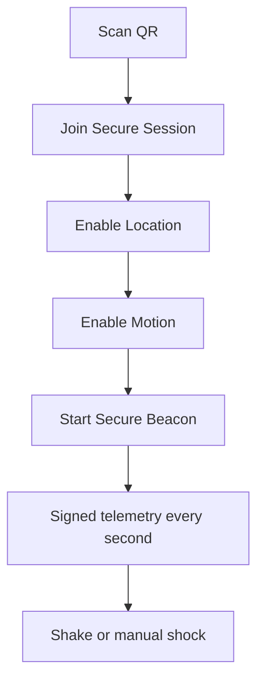
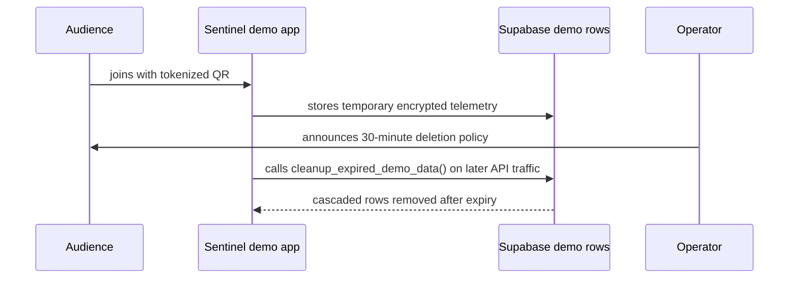
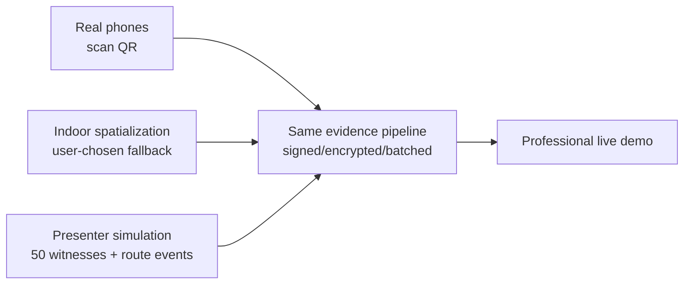

# Demo and Deployment Runbook

This runbook keeps the demo honest and repeatable. It supports two modes:

- **Simulated chain mode:** protocol pipeline works, batches are clearly simulated, no explorer links.
- **Real chain mode:** batch roots are submitted to Monad and verified through RPC + contract `batchRoot`.

## Local Demo

```bash
pnpm install
pnpm dev
```

Open `http://localhost:3000`.

Recommended path:

1. Launch a session from the landing page.
2. Confirm dashboard shows the tokenized QR.
3. Click **Enable Sound** if desired.
4. Click **Spawn 50** to populate the swarm.
5. Click **Bump** to show shock without theft.
6. Click **Mishandling** to show repeated handling risk.
7. Click **Theft** to show shock plus route deviation / unauthorized dwell / seal risk.
8. Click **Cold breach** for a cold-chain example.
9. Click **Emergency batch**.
10. Open the latest receipt.
11. Open `/shipment/[sessionId]` to show the MapLibre journey and delivery policy.

## Mobile Phone Demo

Use HTTPS in production. Browser GPS and motion APIs often require secure context and user gestures.

Mobile flow:



Rules:

- GPS fallback appears only after request failure or user choice.
- Motion fallback appears only after denial/unavailability.
- `watchPosition()` runs after a successful location request.
- iOS-style `DeviceMotionEvent.requestPermission()` runs from the user tap path.

## 30-Minute Demo Data Policy

Audience telemetry is for the live demo only. State this clearly before asking people to scan:

```txt
Your phone becomes a temporary demo sensor.
No wallet. No tokens.
Location/motion data is used for this live proof-of-custody demo
and should be deleted within 30 minutes of capture.
```

Operational rule:

- use tokenized demo sessions, not reusable public sessions
- keep raw/encrypted participant telemetry only for the presentation window
- demo sessions get `expires_at = created_at + 30 minutes` by default
- purge demo sessions opportunistically from API calls and through the SQL cleanup function
- keep only screenshots, aggregate proof counts, and non-sensitive demo receipts
- never publish audience route/location data on-chain or in screenshots

The app calls `cleanup_expired_demo_data()` opportunistically from session creation, session reads, telemetry ingest, and emergency batch creation. Session deletes cascade through the main evidence tables.

```sql
select public.cleanup_expired_demo_data();
```

If a venue asks for immediate removal, delete by exact session id. This cascades through devices, telemetry, incidents, batches, receipts, journey segments, and delivery proofs.

```sql
delete from public.sessions
where id = '<demo-session-id>';
```

Do not document `pnpm sentinel:reset` as a cloud data purge; it currently clears local build artifacts only.



## Phone Permission Troubleshooting

If **Enable Location** says denied even though the phone settings look correct, check these in order:

1. Confirm the QR opens the HTTPS Vercel URL, not `localhost` or an IP address.
2. Open the site in the real browser, not an in-app camera preview or embedded social browser.
3. On iOS, use Safari or Chrome, then check `Settings -> Privacy & Security -> Location Services -> Safari Websites`.
4. On Android Chrome, tap the lock icon in the address bar and allow location for the site.
5. Turn off low-power/browser privacy modes that block precise location for the site.
6. Reload the mobile page and tap **Retry permissions**.
7. If it still fails, tap **Use indoor demo spatialization** and continue the demo.

Common causes:

- permission was previously denied for the domain
- the QR opened inside a camera app webview
- browser location permission is allowed globally but denied for this specific site
- precise location is disabled
- the page is not served over HTTPS
- corporate/venue Wi-Fi or device management blocks sensor APIs

The demo must remain strong even when GPS is denied. Indoor spatialization still creates a signed witness, streams permission state, and lets the presenter simulate movement thresholds.

## Fallback Demo Mode

Use fallback mode when audience participation is slow, GPS is weak, or permissions fail.



Presenter controls should be used as a narrative tool, not as fake chain proof:

- **Spawn 50 witnesses:** shows scale if only a few people scan.
- **Road bump:** shock only; no custody breach.
- **Mishandling:** repeated shock or condition risk; inspect packaging.
- **Likely theft:** shock plus simulated route deviation, unauthorized dwell, seal risk, or silence.
- **Cold breach:** temperature exposure above product policy.
- **Emergency commit:** creates the next evidence batch.
- **Latest receipt:** opens the current proof state.
- **Journey view:** shows source-to-destination route, stops, incidents, and delivery policy.

The UI should explain thresholds visually: normal route, deviation line, dwell circle, shock marker, temperature marker, and delivery-state checks.

## One-Command Helpers

```bash
pnpm sentinel:init
pnpm sentinel:verify
pnpm sentinel:doctor
pnpm sentinel:launch
pnpm sentinel:launch --prod
pnpm sentinel:launch --prod --real-chain
pnpm sentinel:reset
```

`pnpm sentinel:launch --prod`:

1. Checks required env.
2. Checks Vercel CLI auth.
3. Runs tests/build.
4. Deploys with Vercel.
5. Creates a session through `/api/sessions`.
6. Prints dashboard URL, join URL, and terminal QR.
7. Opens the dashboard.

`--real-chain` additionally requires:

```txt
CHAIN_DISABLED=false
MONAD_RPC_URL=
GATEWAY_PRIVATE_KEY=
NEXT_PUBLIC_CONTRACT_ADDRESS=
```

## Doctor Command

```bash
NEXT_PUBLIC_APP_URL=https://your-deployment.vercel.app pnpm sentinel:doctor
```

Checks:

- app reachable
- session creation works
- dashboard token reveals join token
- Supabase env is present
- real chain mode: RPC block number and contract env
- simulated mode: confirms explorer links must be disabled

## Supabase Setup

One-time:

```bash
supabase login
supabase link --project-ref <project-ref>
npx supabase db push
```

Current migrations:

```txt
001_init.sql
002_private_evidence.sql
003_journey_segments_delivery_proofs.sql
```

Set env:

```txt
NEXT_PUBLIC_SUPABASE_URL=
NEXT_PUBLIC_SUPABASE_PUBLISHABLE_KEY=
SUPABASE_SECRET_KEY=
```

The browser uses the publishable key. API routes and workers use the secret key.

## Vercel Setup

```bash
vercel login
vercel env pull .env.local
```

Set at minimum for a cloud demo:

```txt
NEXT_PUBLIC_APP_URL=https://your-vercel-domain.app
NEXT_PUBLIC_SUPABASE_URL=
NEXT_PUBLIC_SUPABASE_PUBLISHABLE_KEY=
SUPABASE_SECRET_KEY=
EVIDENCE_SHIPMENT_SECRET=
EVIDENCE_ENCRYPTION_KEY=
NEXT_PUBLIC_CHAIN_MODE=simulated
NEXT_PUBLIC_CHAIN_DISABLED=true
CHAIN_DISABLED=true
```

Never commit secrets. Do not paste model-provider or gateway keys into source files.

## Monad Setup

1. Install Foundry.
2. Fund the gateway wallet on Monad Testnet.
3. Deploy:

```bash
MONAD_RPC_URL=... GATEWAY_PRIVATE_KEY=... pnpm contracts:deploy
```

4. Configure:

```txt
NEXT_PUBLIC_MONAD_CHAIN_ID=10143
NEXT_PUBLIC_CONTRACT_ADDRESS=
MONAD_RPC_URL=
GATEWAY_PRIVATE_KEY=
CHAIN_DISABLED=false
NEXT_PUBLIC_CHAIN_DISABLED=false
NEXT_PUBLIC_CHAIN_MODE=real
```

5. Run:

```bash
pnpm sentinel:launch --prod --real-chain
```

## Current Production Proof

The production deployment is configured for real Monad Testnet evidence anchoring.

```txt
Production app:       https://monad-sentinel.vercel.app
Monad Testnet ledger: 0xAF28B5Afd7f2CCaF5b65467fca5777330690b9b5
Verified batch tx:    0xcefd4963426be1069fcff0689f080cde0a0ea4eec2e86fd0a58bdfeb69391576
Verified block:       37247395
Batch root:           0x6f715e392f81be4b56870385b9c705899d3be44d7eddd6171ab1e64c4c54a49c
```

This proof was accepted only after `/api/chain/verify-batch` checked the tx receipt, decoded the `BatchCommitted` log, read `batchRoot(...)` from the contract, and matched it against the local Merkle root.

## Chain Agent

Run during demos:

```bash
pnpm agent:dev
```



```mermaid
sequenceDiagram
  participant DB as Supabase
  participant Agent as Chain Agent
  participant Monad as Monad contract
  participant RT as Realtime

  Agent->>DB: poll unbatched telemetry_events
  Agent->>Agent: build Merkle tree + proofs
  Agent->>DB: insert telemetry_batches
  alt CHAIN_DISABLED=false
    Agent->>Monad: commitBatch
    Monad-->>Agent: receipt
    Agent->>DB: mark committed / verified metadata
  else simulated
    Agent->>DB: mark simulated
  end
  Agent->>RT: chain.batch.committed
```

## Receipt Verification

Real verification path:

1. Receipt loads batch row.
2. `/api/chain/verify-batch` checks chain mode.
3. Fetches transaction receipt.
4. Decodes `BatchCommitted`.
5. Reads `batchRoot(shipmentCommitment, sequence)`.
6. Compares log root and contract root to DB Merkle root.
7. Marks verified only on exact match.

Simulated mode:

- returns `verified=false`
- displays **Simulated receipt only**
- disables explorer links

## Screenshot Capture Checklist

Capture screenshots after every meaningful visual upgrade and store them under `docs/screenshots`.

Required screenshots:

- landing page: privacy-preserving evidence-layer positioning
- dashboard: command center with QR, swarm, evidence rail, and presenter controls
- mobile join screen
- mobile permission ceremony
- shipment journey map with MapLibre route layers
- simulated receipt guardrail
- sample selective reveal receipt
- real Monad transaction and verified receipt, only after real-chain deployment

Real transaction screenshot requirements:

1. `CHAIN_DISABLED=false`
2. `NEXT_PUBLIC_CHAIN_MODE=real`
3. deployed `SentinelEvidenceLedger`
4. funded gateway wallet
5. `commitBatch` transaction broadcast
6. `/api/chain/verify-batch` returns `verified=true`
7. receipt page shows contract-root match
8. explorer link opens the same tx hash

Do not add a Monad explorer screenshot for simulated batches. If the chain is simulated, document it as simulated and keep the explorer link hidden.

## Optional AI Agents

Current code includes deterministic narration fallback. Optional model-backed agents should use provider-agnostic env names and typed tools only.

Recommended env shape:

```txt
AI_BASE_URL=
AI_API_KEY=
AI_MODEL=
AI_FAST_MODEL=
AI_SAFETY_MODEL=
AI_ENABLED=true
```

Guardrails:

- no private keys in model context
- no raw route data unless required for an authorized summary
- no direct DB/chain writes from model output
- structured JSON only
- log tool calls in `agent_actions`
- deterministic fallback when env is missing

If any model API keys were pasted into chat or terminal history, rotate them before production use.

## 2.5-Minute Pitch Flow

```txt
0:00  "Make logistics telemetry provable without making it public."
0:12  "We are the evidence layer for platforms that already track shipments."
0:25  Launch live proof demo and show the large QR.
0:40  Phones join; each becomes a temporary signed witness.
0:55  If the room is slow, press Spawn 50 and say this is the load-test/simulation layer.
1:10  Trigger Road bump: shock detected, no custody breach.
1:25  Trigger Likely theft: shock + route deviation + unauthorized dwell.
1:45  Open Journey view: source, destination, route, dwell, incident, delivery policy.
2:05  Emergency commit; evidence rail shows batch root and status.
2:20  Open receipt; explain signature, Merkle proof, and chain root or simulated guardrail.
2:30  Close: "Visibility platforms show what sensors saw. Sentinel proves the evidence was not rewritten."
```

## Troubleshooting

### QR points to localhost

Set `NEXT_PUBLIC_APP_URL` to the public deployment URL and redeploy.

### Phone cannot get GPS or motion

Use HTTPS. Tap the explicit permission buttons. If the browser denies APIs, use indoor spatialization and manual shock fallback.

If location is denied repeatedly:

- clear site permissions for the Vercel domain
- avoid in-app QR scanner browsers
- open the join URL directly in Safari/Chrome
- check per-site location permission, not only global location settings
- use **Retry permissions** after changing settings
- continue with **Use indoor demo spatialization** if the venue/device blocks GPS

Tell participants the 30-minute deletion policy before the QR scan to increase comfort.

### Dashboard does not update

Check Supabase URL/key/server key and Realtime configuration. Local simulation still works without live Supabase.

### Receipt says simulated receipt only

Expected when `CHAIN_DISABLED=true`, `NEXT_PUBLIC_CHAIN_MODE=simulated`, or the batch status is `simulated`.

### A simulated batch opens an explorer

This is a bug. Simulated batches must not create Monad explorer links.

### Chain verification fails

Check:

- `CHAIN_DISABLED=false`
- `MONAD_RPC_URL`
- `NEXT_PUBLIC_CONTRACT_ADDRESS`
- tx hash exists
- contract address matches deployment
- batch was committed to the same network

### Supabase CLI asks for macOS keychain password

macOS is asking to unlock the saved Supabase CLI token. This is separate from Google login. Allow once, or kill stale `supabase` processes and rerun `supabase login`.

### Foundry commands fail

Install Foundry. `pnpm sentinel:verify` skips Solidity tests when `forge` is unavailable, but real contract testing needs it.
