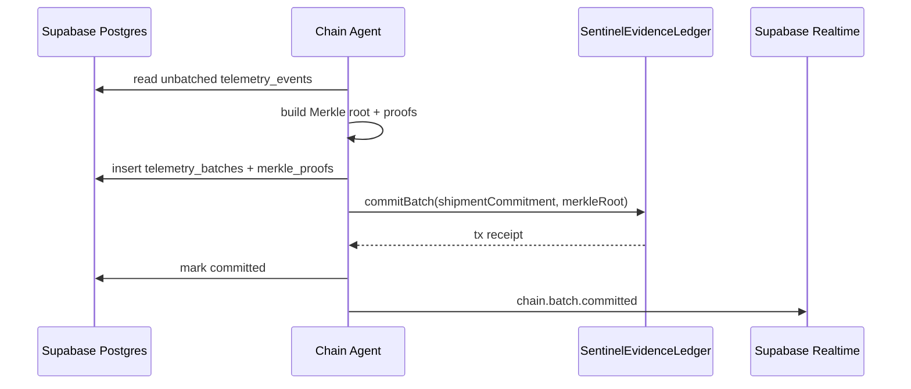

# Chain Agent

Long-running worker that turns verified telemetry rows into Monad evidence batches.

## Responsibilities

1. Poll unbatched `telemetry_events`.
2. Group by session.
3. Build Merkle roots and proofs.
4. Insert `telemetry_batches`.
5. Submit `commitBatch(shipmentCommitment, sequence, merkleRoot, ...)` to Monad when enabled.
6. Update batch/event rows with tx status.
7. Broadcast `chain.batch.committed` to the dashboard.

## Flow



## Run

```bash
pnpm agent:dev
```

With missing Supabase env, the worker waits instead of crashing.

## Chain Modes

- `CHAIN_DISABLED=true`: simulated tx hashes, clearly labeled.
- `CHAIN_DISABLED=false`: requires Monad RPC, gateway private key, and deployed contract address.
