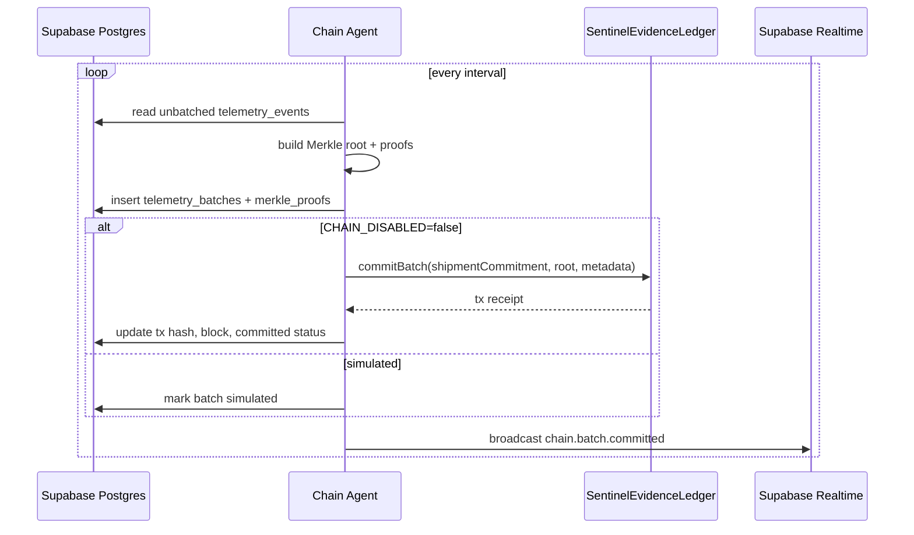
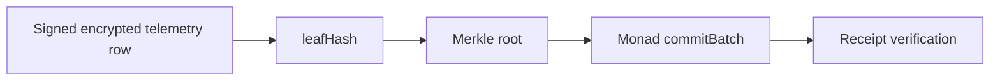

# Chain Agent

Long-running worker that turns verified off-chain telemetry into Monad evidence batches.

The Chain Agent is the production path for batching. The serverless emergency commit endpoint mirrors the same proof tables for demo safety, but it is not a replacement for a worker with retry and nonce management.

## Responsibilities

1. Poll unbatched `telemetry_events`.
2. Group by session/shipment.
3. Sort events deterministically.
4. Build Merkle roots and per-event proofs.
5. Insert `telemetry_batches` and `merkle_proofs`.
6. Submit `commitBatch` to Monad when real chain mode is enabled.
7. Store tx hash, block, and status.
8. Broadcast `chain.batch.committed`.

## Flow



## Chain Modes

```txt
CHAIN_DISABLED=true
  simulated batch only
  no explorer links
  receipt verification returns mode=simulated, verified=false

CHAIN_DISABLED=false
  requires Monad RPC
  requires deployed contract
  requires gateway private key
  receipt verification can read contract batchRoot
```

## Trust Role

The Chain Agent does not create truth by itself. It turns already-ingested signed evidence rows into a Merkle root and anchors that root.



## Run

```bash
pnpm agent:dev
```

If Supabase or Monad env vars are missing, the worker should wait or simulate clearly instead of presenting fake chain proof.
