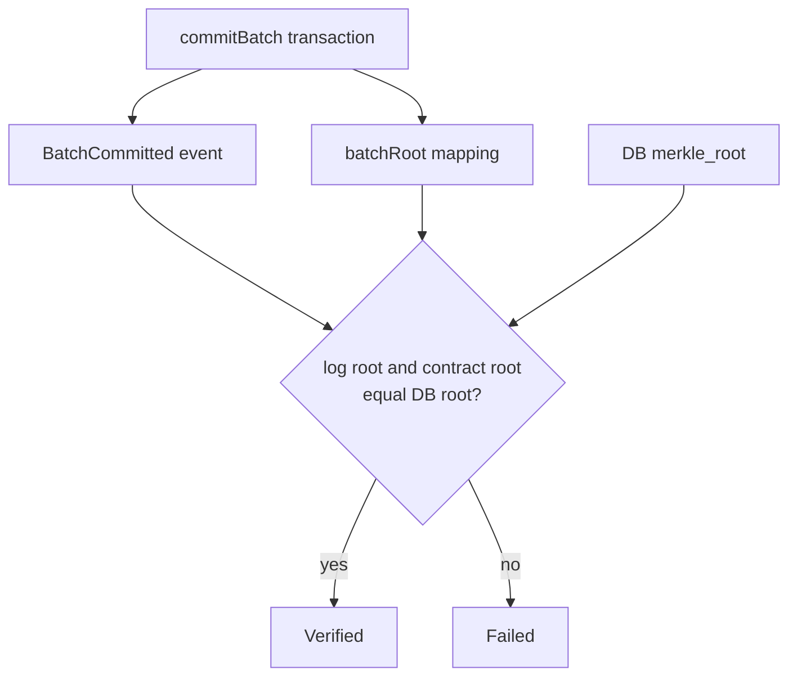

# Contracts

Foundry project for Monad Sentinel evidence commitments.

The contract stores compact public commitments only. It is not a telemetry database.

## Contract Role

```mermaid
flowchart LR
  Offchain[Encrypted off-chain telemetry]
  Merkle[Merkle root]
  Ledger[SentinelEvidenceLedger]
  Receipt[Receipt verifier]

  Offchain --> Merkle
  Merkle --> Ledger
  Ledger -->|batchRoot(shipment, sequence)| Receipt
```

## `SentinelEvidenceLedger`

Stores:

- shipment authority
- route policy commitment
- destination commitment
- Merkle root per shipment/sequence
- incident evidence hash events
- delivery evidence hash events

Does not store:

- raw GPS
- route arrays
- temperature readings
- shock samples
- product/customer names
- device identities

## Public API

```solidity
createShipment(
  bytes32 shipmentCommitment,
  bytes32 routePolicyCommitment,
  bytes32 destinationCommitment
)

commitBatch(
  bytes32 shipmentCommitment,
  uint64 sequence,
  bytes32 merkleRoot,
  uint32 sampleCount,
  uint16 maxRiskScore,
  uint16 combinedFlags,
  bytes32 dataAvailabilityHash,
  uint256 timeBucket
)

commitIncident(
  bytes32 shipmentCommitment,
  bytes32 evidenceHash,
  uint16 riskScore,
  uint16 flags,
  uint64 batchSequence
)

confirmDelivery(
  bytes32 shipmentCommitment,
  bytes32 deliveryEvidenceHash,
  bytes32 receiverCommitment,
  uint64 batchSequence
)

batchRoot(bytes32 shipmentCommitment, uint64 sequence)
```

Compatibility wrappers for older session-oriented tests may exist, but new app code should use shipment commitments.

## Verification Model



## Commands

```bash
pnpm contracts:build
pnpm contracts:test
pnpm contracts:deploy
```

These require Foundry and `forge`.

## Deploy Inputs

```txt
MONAD_RPC_URL=
GATEWAY_PRIVATE_KEY=
```

After deployment, configure:

```txt
NEXT_PUBLIC_CONTRACT_ADDRESS=
MONAD_RPC_URL=
CHAIN_DISABLED=false
NEXT_PUBLIC_CHAIN_MODE=real
```
