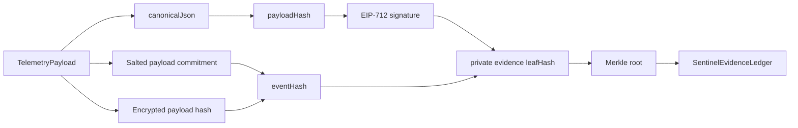

# Shared Protocol Package

`@monad-sentinel/shared` contains protocol code used by the web app and Chain Agent.

## Includes

- Zod schemas for telemetry.
- Canonical JSON serialization.
- Payload hashing with `keccak256`.
- EIP-712 typed data generation and signer recovery.
- Private evidence commitments and leaf hashing for Merkle batches.
- Merkle root, proof generation, and proof verification.
- Deterministic risk scoring and custody event classification.
- Motion, stop/dwell, distance, and cold-chain exposure helpers.
- Realtime event view types.

## Protocol Sketch



## Test

```bash
pnpm --filter @monad-sentinel/shared test
```
