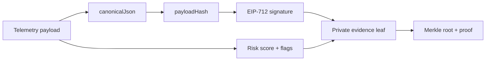
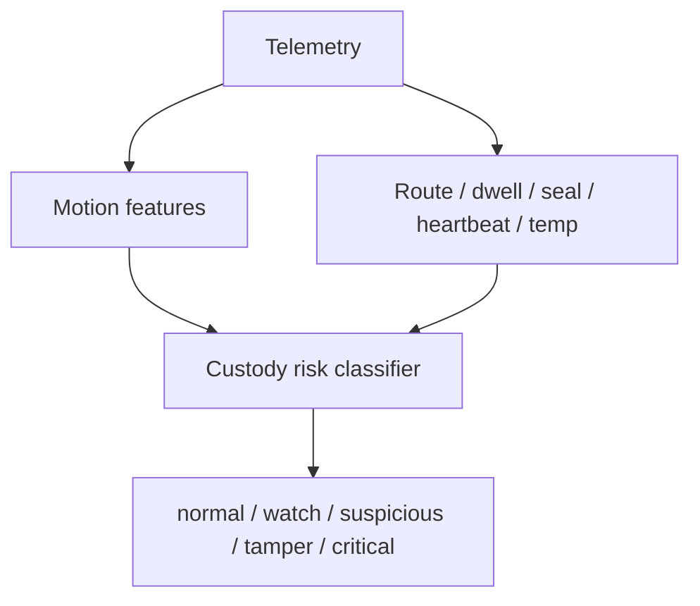

# Shared Protocol Package

`@monad-sentinel/shared` contains deterministic protocol and algorithm code shared by the web app and Chain Agent.

## Responsibilities

- Zod schemas for telemetry and realtime events.
- Canonical JSON serialization.
- Payload hashing with `keccak256`.
- EIP-712 typed data definitions and signer recovery.
- Private evidence leaf hashing.
- Merkle root/proof generation and proof verification.
- Deterministic risk classification.
- Haversine distance helpers.
- Stop/dwell detection helpers.
- Motion/shock feature helpers.
- Cold-chain exposure helpers.

## Protocol Role



## Deterministic Algorithms

The package keeps the demo explainable without a model API:

- shock is not theft by itself
- route deviation and dwell are separate custody signals
- temperature risk uses exposure over time
- delivery confirmation is a multi-step policy



## Test

```bash
pnpm --filter @monad-sentinel/shared test
```
