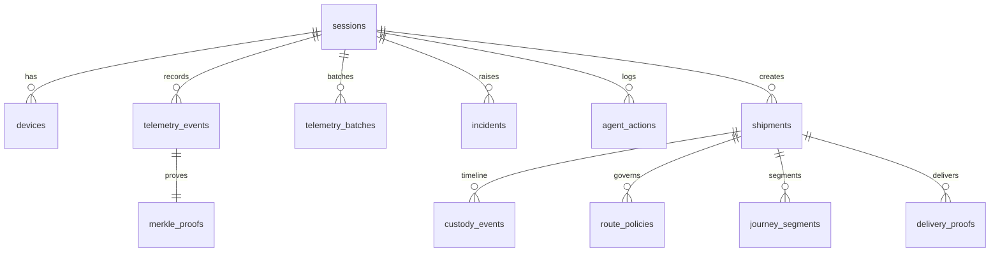
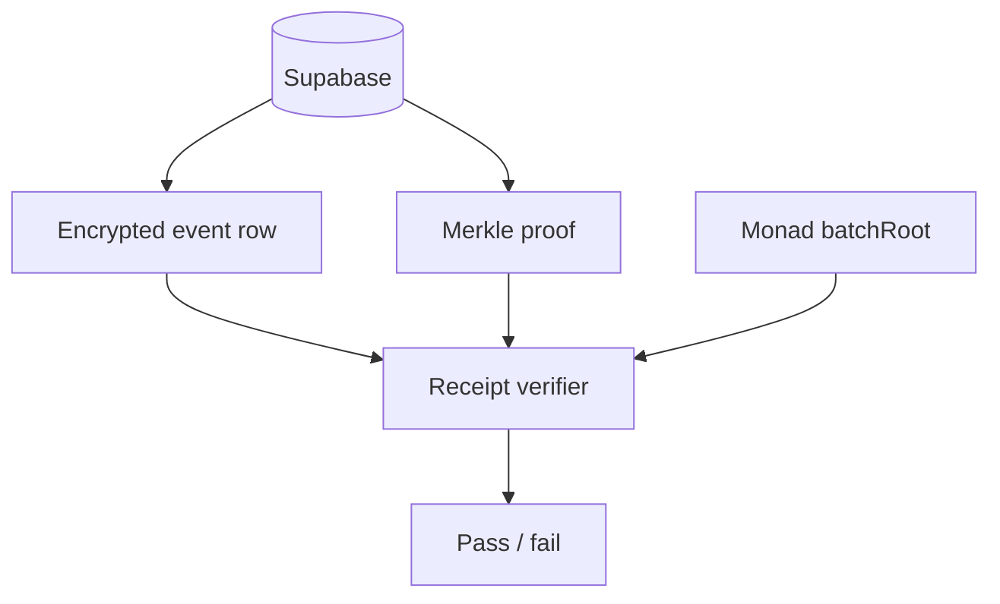

# Supabase

Supabase is the application database, realtime relay, and encrypted data availability layer. It is not the public trust anchor. Monad stores the commitment roots used to detect silent history rewrites.

## Migration

```bash
npx supabase db push
```

Current migrations:

```txt
001_init.sql
002_private_evidence.sql
003_journey_segments_delivery_proofs.sql
```

## Data Model



## Main Tables

- `sessions`: live demo sessions, public/private tokens, session mode.
- `devices`: joined witnesses and latest state.
- `telemetry_events`: signed telemetry rows, encrypted payload envelopes, commitments, risk outputs.
- `telemetry_batches`: Merkle batch state and chain receipt metadata.
- `merkle_proofs`: inclusion proof per telemetry event.
- `incidents`: risk alerts and summaries.
- `agent_actions`: audit log for proposed/executed agent actions.
- `chain_outbox`: queue foundation for robust chain retries.
- `shipments`: authorized journey records and delivery state.
- `custody_events`: pickup/telemetry/shock/route/cold-chain/delivery timeline.
- `route_policies`: encrypted/committed route policy metadata.
- `evidence_receipts`: receipt records per batch.
- `journey_segments`: movement/stop/deviation/delivery segments.
- `delivery_proofs`: destination dwell, receiver handoff, final condition, final batch state.

## Security Model

- Browser clients do not write durable telemetry rows directly.
- Phones POST signed telemetry to `/api/telemetry/batch`.
- Telemetry must include the QR join token.
- API routes use a server-side Supabase key.
- Raw payload details are encrypted and stored in `encrypted_payload`.
- Public chain receives only commitments.
- Dashboard subscribes to session channels for live state.
- Never expose service-role or secret keys to browser code.

## Trust Model



Supabase can make data queryable and available. It cannot silently rewrite committed evidence because the signature, hash chain, Merkle proof, and Monad root would no longer match.

## Realtime Use

- Broadcast: telemetry, alerts, chain events, agent events.
- Presence: online/offline device state only.

Do not use Presence for high-frequency telemetry.
